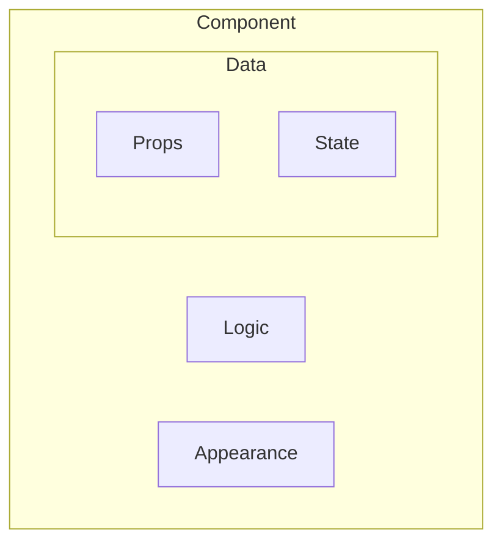

```
                    ██████╗ ███████╗ █████╗  ██████╗████████╗
                    ██╔══██╗██╔════╝██╔══██╗██╔════╝╚══██╔══╝
                    ██████╔╝█████╗  ███████║██║        ██║   
                    ██╔══██╗██╔══╝  ██╔══██║██║        ██║   
                    ██║  ██║███████╗██║  ██║╚██████╗   ██║   
                    ╚═╝  ╚═╝╚══════╝╚═╝  ╚═╝ ╚═════╝   ╚═╝   
                                                             
                        ██████╗  █████╗ ██╗   ██╗    ██████╗ 
                        ██╔══██╗██╔══██╗╚██╗ ██╔╝    ╚════██╗
                        ██║  ██║███████║ ╚████╔╝      █████╔╝
                        ██║  ██║██╔══██║  ╚██╔╝       ╚═══██╗
                        ██████╔╝██║  ██║   ██║       ██████╔╝
                        ╚═════╝ ╚═╝  ╚═╝   ╚═╝       ╚═════╝ 
                                                             
```

<!--truncate-->

## React Component

1. React 透過 Component 組成畫面。
2. 每一個 Component 都是一個函式，回傳 JSX。
3. 每一個 Component 都包含：`Data`, `Logic`, `Appearance`。
4. Component 開頭必須要大寫英文，跟 html 的標籤區隔。
5. 不要在一個 Component 內，定義另外一個 Component。




:::danger
```jsx
function App() {
  
  // 不要這樣定義
  function Pizza() {
    return <h1>Pizza</h1>;
  }

  return (
    <div>
      <h1>Hello React!</h1>
      <Pizza />
    </div>
  );
}
```
:::

## JSX

> JSX is a syntax extension for JavaScript that lets you write HTML-like markup inside a JavaScript file. 

透過這種擴展語法，可以很方便地將一個 Component 所需要的 `html`, `css`, `javascript`，都放在同一個區塊內。

<details>
JSX 實際上是透過 Babel 被轉換為 Jacascript 語法。  
</details>

:::info
傳統上會將這三個分別拆開編輯，達到可維護性和一致性，但是當畫面的呈現越來越複雜，以 Component 為中心的設計，出發點要以單個元件為主。

與其維持將三種類型的語法拆開撰寫，不如寫在同一個區塊內做 render，這也是 JSX 所要做到的事情，也是 React 的 Component 設計理念。
:::

### Imperative vs Declarative

- Imperative: 命令式，`How to do things`。(pure Javascript)  
需要一步一步告訴瀏覽器，在甚麼邏輯下，需要做甚麼事情。

- Declarative: 宣告式，`What UI should look like`。(JSX)  
只需要預先定義好，那些區塊應該呈現甚麼樣子和資料，只要遷入到畫面上，就可以按照定義呈現區塊畫面和資料邏輯。

## Separation of Concerns

|    Tranditional     |         React          |
| :-----------------: | :--------------------: |
| Technology Per File | One Component Per File |

## Props && State

> React components use props to communicate with each other.   
> Every parent component can pass some information to its child components by giving them props.

1. Props 只能被父元件更新，資料來源屬於 Component 的外部。
2. State 只能被 Component 內的邏輯觸發修改。

✨ Props 在 Component 內部是不可變的。(ReadOnly)  
✨ 當有需要更新 Props，要使用 State 而不是 Props。

### Why immuatable

在 Component 內修改 Props 可能會導致其他地方受到影響。(父元件)  
這邊跟 `Functional Programming` 的概念是一致的，避免變數值變動所導致的的邊際效應。

### One-Way Data Flow
React 只允許資料由上到下，不允許子元件往上變動/傳遞資料。

## Reference
[The Ultimate React Course](https://www.udemy.com/course/the-ultimate-react-course)  
[StrictMode](https://react.dev/reference/react/StrictMode)  
[Props](https://react.dev/learn/passing-props-to-a-component)
