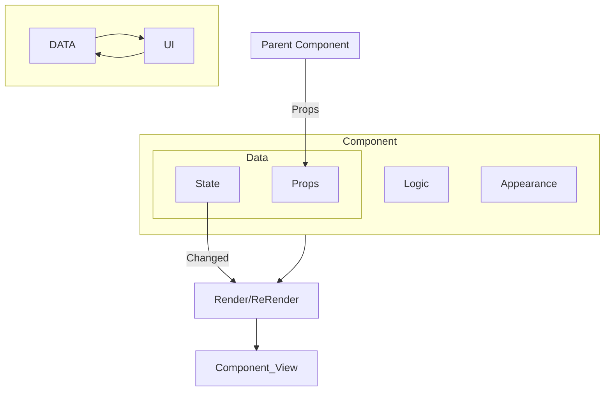

```
                    ██████╗ ███████╗ █████╗  ██████╗████████╗
                    ██╔══██╗██╔════╝██╔══██╗██╔════╝╚══██╔══╝
                    ██████╔╝█████╗  ███████║██║        ██║   
                    ██╔══██╗██╔══╝  ██╔══██║██║        ██║   
                    ██║  ██║███████╗██║  ██║╚██████╗   ██║   
                    ╚═╝  ╚═╝╚══════╝╚═╝  ╚═╝ ╚═════╝   ╚═╝   
                                                             
                        ██████╗  █████╗ ██╗   ██╗    ███████╗
                        ██╔══██╗██╔══██╗╚██╗ ██╔╝    ██╔════╝
                        ██║  ██║███████║ ╚████╔╝     ███████╗
                        ██║  ██║██╔══██║  ╚██╔╝      ╚════██║
                        ██████╔╝██║  ██║   ██║       ███████║
                        ╚═════╝ ╚═╝  ╚═╝   ╚═╝       ╚══════╝
                                                             
```

<!--truncate-->

## What's React State?
> Components need to “remember” things: the current input value, the current image, the shopping cart.

> In React, this kind of component-specific memory is called state.

這個元件在整個應用的生命週期內，需要記憶的資訊，被稱為狀態 (State)。  
更新元件的狀態，React 會重新渲染元件，產生新的 Component View。



## Controlled Component
這邊看起來舊版跟新版的文件在理解上可能會有落差，reddit 上面也有不少討論，整理並理解的內容下。

1. 對於 Parent Component 來說，Child Component 的狀態，因為是內部控制的，沒法透過`Props`來改變，所以是不可控的。
2. 對於 input 類來說，DOM 的狀態部沒有被 react 控制，所以沒有使用 state 的 input 是不可控的。
3. 對於可控的 input，屬於 `Controlled Input`，反之則是 `Uncontrolled Input`。
4. 對於可控的 Component，屬於 `Controlled Component`，反之則是 `Uncontrolled Component`。

## Developer Tool

### Browser Extension
https://react.dev/learn/react-developer-tools

## 實作建議

1. `StateVariable`: 當你需要這個 Component 記憶/追蹤資料，且這個資料可能會在某個時間點發生變化。
2. `A PieceOfState`: 當你需要這個 Component 能夠根據某些事件或是操作，動態呈現不一樣的內容。(ex: 透過 isOpen 這個狀態來控制是否要呈現 Conponent 內容)
3. `EventHandler`: 當你需要透過狀態改變 Component 的外觀。

## State vs Props

|           State            |           Props           |
| :------------------------: | :-----------------------: |
|       Internal Data        |       External Data       |
|      Component Memory      |    Function Parameters    |
|   Can be updated by self   |         Read-Only         |
|  StateChanged-> Re-Render  |                           |
| Make Component Interactive | Configure Child Component |

## Reference
[The Ultimate React Course](https://www.udemy.com/course/the-ultimate-react-course)  
[ReactState](https://react.dev/learn/state-a-components-memory)  
[Controlled & UnControlled](https://react.dev/learn/sharing-state-between-components#controlled-and-uncontrolled-components)  
[Has React changed the meaning of uncontrolled/controlled components?](https://www.reddit.com/r/reactjs/comments/17homhu/has_react_changed_the_meaning_of/)
