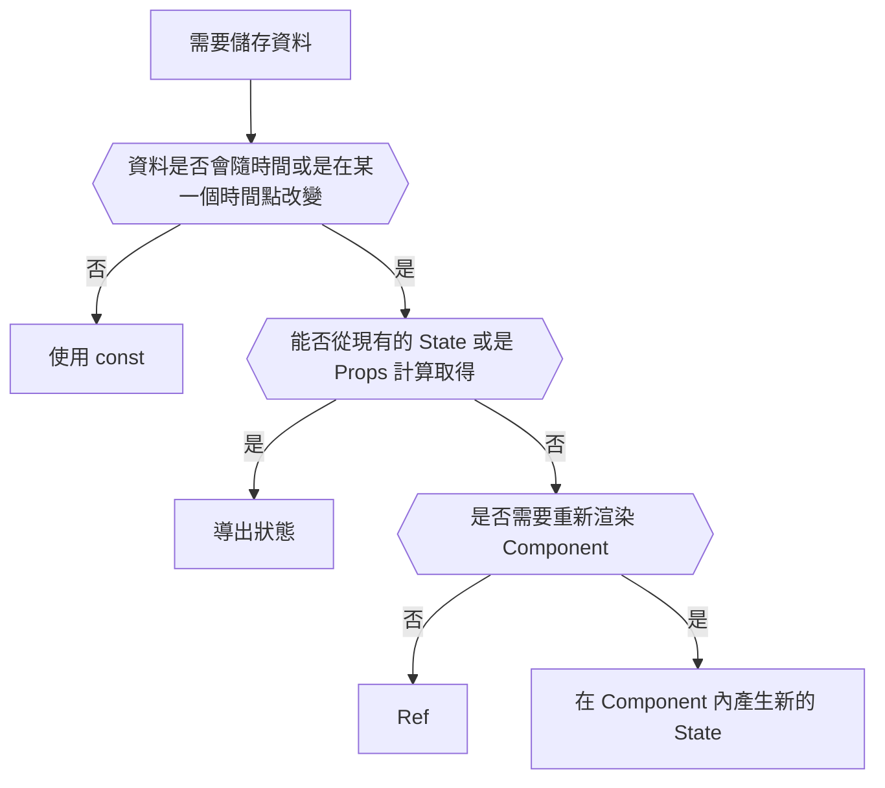
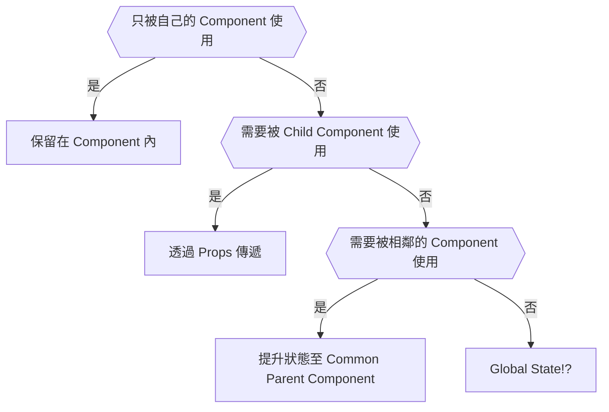

```
                    ██████╗ ███████╗ █████╗  ██████╗████████╗                     
                    ██╔══██╗██╔════╝██╔══██╗██╔════╝╚══██╔══╝                     
                    ██████╔╝█████╗  ███████║██║        ██║                        
                    ██╔══██╗██╔══╝  ██╔══██║██║        ██║                        
                    ██║  ██║███████╗██║  ██║╚██████╗   ██║                        
                    ╚═╝  ╚═╝╚══════╝╚═╝  ╚═╝ ╚═════╝   ╚═╝                        
                                                                                  
                        ██████╗  █████╗ ██╗   ██╗     ██████╗                     
                        ██╔══██╗██╔══██╗╚██╗ ██╔╝    ██╔════╝                     
                        ██║  ██║███████║ ╚████╔╝     ███████╗                     
                        ██║  ██║██╔══██║  ╚██╔╝      ██╔═══██╗                    
                        ██████╔╝██║  ██║   ██║       ╚██████╔╝                    
                        ╚═════╝ ╚═╝  ╚═╝   ╚═╝        ╚═════╝                     

```

<!--truncate-->

## State Management

定義要在何時建立各個部分的狀態、需要哪些類型的狀態、每個狀態放置在哪裡，以及資料如何在應用程式中傳遞。

### Local / Global State

| Local State                                    | Global State                  |
| :--------------------------------------------- | :---------------------------- |
| State 只被部分的 Component 使用                | 每個 Component 都可以取得使用 |
| 定義在 Component 內，只有自己和 Child 可以取得 |                               |
| 除非必要，否則一律都用 Local State             |                               |

### 使用時機



### 存取範圍



## Derived State

從 Component 內現有的 Props & States 計算出的狀態。

<details>
<summary>Don't Do This!!!</summary>

```js
const [cart, setCart] = useState([
  { name: "JavaScript Course", price: 15.99 },
  { name: "Node.js Bootcamp", price: 14.99 },
]);

// 為了取得 numItems 和 totalPrice，多定義兩個 State
// 一方面是沒必要，另外一方面是這樣會導致這個 Component State 改變時，需要渲染三次
const [numItems, setNumItems] = useState(2);
const [totalPrice, setTotalPrice] = useState(30.98);
```

</details>

```js
const [cart, setCart] = useState([
  { name: "JavaScript Course", price: 15.99 },
  { name: "Node.js Bootcamp", price: 14.99 },
]);

// Re-Render 的時候會重新呼叫該方法，所以用 cart 的內容取得資料就好
const numItems = cart.length;
const totalPrice = cart.reduce((acc, cur) => acc + cur.price, 0);
```

## Reference
[The Ultimate React Course](https://www.udemy.com/course/the-ultimate-react-course)