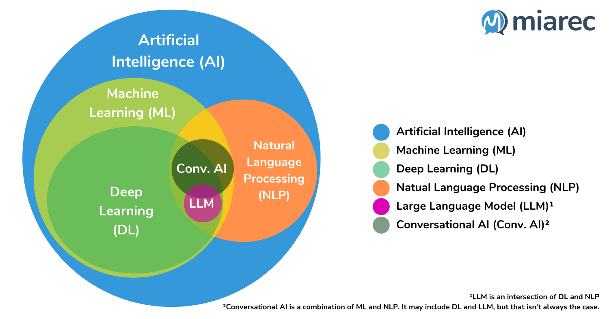

## 前言/引言

這幾年不管是身在哪個領域，或是任何得職業，可能每天都會聽到「AI」和「LLM」這兩個詞，它們似乎無所不在，從智慧手機的語音助理到自動生成文章的工具，好像已經變成生活中不可或缺的一部分!?

但它們究竟是什麼？彼此之間有什麼關係？

## **人工智慧（Artificial Intelligence, AI）**

**AI** 是一個廣泛的電腦科學領域，致力於創造能夠執行通常需要人類智慧的任務的機器，例如學習、推理和解決問題，這個領域涵蓋了所有能讓電腦展現「智慧」的方法。

:::info

:::

### 機器學習（ML）

ML 是 AI 的子集 (subset)。與其為機器的每一步都編寫詳細的規則，ML 讓機器**從大量的數據中自動學習**。就像人類從經驗中學習一樣，機器從數據中「吸取經驗」，進而理解 文字/語音 的涵義。

- **簡單來說：** ML 是 AI 的一個子集，專注於「從數據中學習」。
- **例子：** 電子郵件的垃圾郵件過濾器（它從大量郵件中學會辨識垃圾郵件的特徵）、影音平台的推薦系統（它根據您的觀看歷史推薦您可能喜歡的內容）。

### 深度學習（DL）

DL 是 ML 的一個子集。它使用一種稱為「人工神經網路」的架構，其靈感來自於人腦的結構。所謂的「深度」，指的是這些神經網路通常有很多層，使其能夠處理更複雜的模式和更抽象的資訊。

傳統的機器學習中，學習過程是受監督的，程式設計師必須非常具體地告知電腦它應該尋找哪些類型的特徵，以便判斷；深度學習的優勢在於程式能夠在無監督的情況下自行建構特徵集。

- **例子：** 手機的人臉辨識解鎖（它從無數張臉孔圖片中學會了辨識您的臉）、醫療影像分析（輔助醫生從 X 光片中識別病灶）。

### 大型語言模型（LLM）

語言模型 (LM) 是一種自然語言的機率模型，能夠根據其訓練的文本語料庫，產生一系列單字的機率。

LLM 是**深度學習的一種具體應用和產物**，專門用來處理和生成**人類語言**。它們透過在海量（「大型」的由來）的文本數據上進行訓練，利用深度學習的「轉換器（Transformer）」架構，學會了語法、語義、上下文，甚至一定程度的推理能力。

- **例子：** ChatGPT、Google Gemini 等聊天機器人（能夠與您流暢對話、回答問題）、程式碼自動完成工具（能夠理解您的意圖並生成程式碼）。

## Reference
https://blog.miarec.com/contact-centers-ai-definition  
