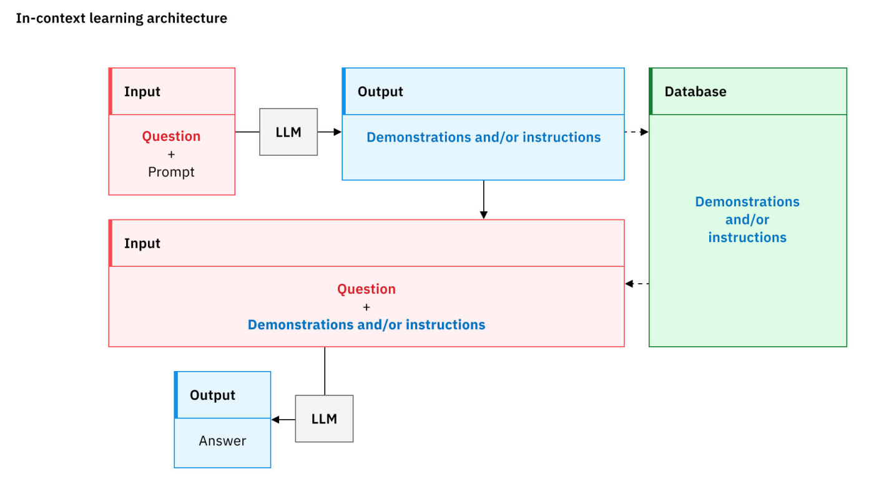
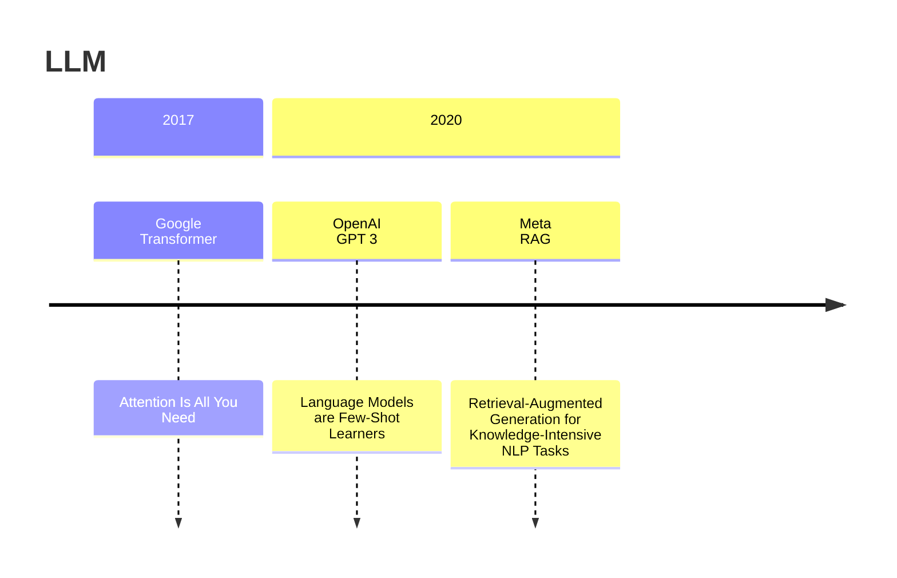
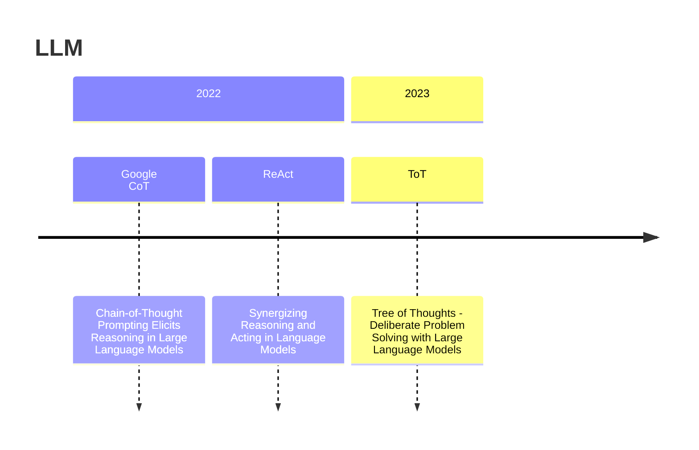
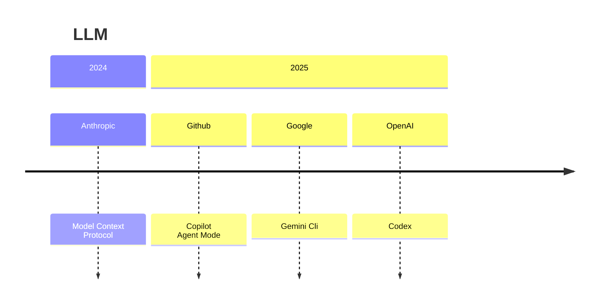

## 提示工程 (Prompt Engineering)

目前的 LLM 本質上還是機率模型，所以要如何透過所謂的提示詞 (Prompt)，提供模型我們想要回覆的預期方向，讓模型能夠猜的更準，變成使用AI的第一個要掌握的重點。

當我們將觀念從傳統的 **指令** 改為 **提示詞**，自然也就衍生出常見的 Pattern。

## Pattern

### 角色提示

- 定義：賦予一個專家角色，模型會優先使用與該角色相關的背景知識、語氣、和思考模式。
- 範例：
  > 你是一位擁有 20 年經驗的美食作家，擅長將複雜概念的味覺感受轉化成文字描述。

### 上下文提示
- 定義：完成這個任務/目標，模型需要知道的基本上下文(脈絡)。
- 範例：
  > 這份報告的目標讀者是沒有咖啡豆背景知識的潛在投資者，所以請避免使用過多專業術語。報告的重點應放在市場規模、主要參與者和潛在風險上。

### 限制提示

- 定義：避免模型過於發散，明確規定輸出的風格、語氣、篇幅，甚至是格式(ex: markdown, xml...)。
- 範例：
  > 正向: 請用一種熱情、活潑、充滿鼓勵的語氣來撰寫這封歡迎新員工的郵件，全文不得超過 100 字。  
  > 反向: 請為我比較 A 和 B 兩款手機的優缺點。請**不要考慮價格**因素，只專注於**硬體規格**和**用戶體驗**。

### 範例提示

- 定義：透過小且精確的範例，讓模型直接當作參考依據。
- 範例：
  > 請將最終結果以下方形式呈現：  
  > 品項：xxx咖啡豆  
  > 產地：來自衣索比亞的單一產區。  
  > 特點：豐富的花香和柑橘風味。

### 翻轉提示

- 定義：當你自己也不完全清楚完成任務需要哪些資訊時，可以利用這個模式，讓 AI 扮演專家的角色，來引導您提供必要的資
- 範例：
  > 你是一位資深的商業分析師(Business Analyst)。擅長引導客戶進行需求探索。我們的共同目標是透過一系列的對話討論，為一個新的商業提案做出分析報告。

## 系統提示詞 vs 使用者提示詞

### 系統提示詞
定義 AI 對話的核心，包含角色、個性、行為準則和長期目標，且會在整個任務中持續生效。

:::tip
你是一位名叫「數學小老師」的 AI 家教。  
你的任務是：  
1.  只回答國小六年級以下的數學問題。  
2.  如果問題超出範圍，要禮貌地拒絕，並說明你的專長是國小數學。  
3.  解釋問題時，要使用生動的比喻，讓小朋友容易理解。  
4.  絕對不能直接給出答案，必須先引導小朋友思考。
:::

### 使用者提示詞
使用者想要跟互動的AI(不論是否包含設定好角色)，發問的內容。

## 如何開發提示詞

由於模型本身是機率模型，所以開發提示詞的過程中，一定少不了多次的嘗試與持續調整，甚至不同版本的模型，各自對應的提示詞也會有所不同。

只能通過不斷的試驗，逐漸優化提示，觀察輸出結果，才能做出一個讓自己滿意的提示詞。

1. 避免全方位的角色
   > 越全面的角色，設定的內容越多越複雜，也更容易失焦，反而傾向於攏統描述，不如針對各項專精的項目，謹慎地設定好每個角色分別應該具備的能力與期待完成的目標，才能更有方向的去調教設定，優化產生的品質。
2. 持續優化、反覆實驗
   > 相同的提示詞，在同一個模型執行多次也會有不同的結果，不同模型間的效果落差甚至會更明顯，只有針對不同的場景，反覆實驗，直到能夠在主要使用的模型上，取得不錯的結果。
3. 不必過於追求完美
   > 提示工程雖然有指引，但並沒有標準答案，有些提示詞也許第一次問答的結果不夠好，但是根據第一次的回答作為 context 的一部分，往後展開，也許就會出現想要的內容。
4. Deep Domain Knowledge
   > 只有當領域知識足夠深厚，才能夠提供更深刻的關鍵詞、Context，讓模型更精準找到你需求的內容，甚至基於這些內容，產生更深刻的結論或是推斷，讓你去做更深的思考。  
5. 清晰 != 囉嗦。
   > 有時候，一個精準的技術術語(關鍵字)比一段冗長的描述更有效。關鍵在於找到「恰到好處」的資訊量，—既能完整傳達意圖，又不會引入不必要的噪音。
6. 限制
   > 避免模型過於發散，如同前面說到的，我們做提示的目的，就是希望能夠讓模型**猜得準**，所以透過限制，明確告訴模型不能包含哪些部分，也會是很好的引導。

## Key Concept

### In-Context Learning (ICL)

模型無需更新自身參數（即無需重新訓練），僅透過分析提示中提供的範例，就能學會並執行新任務。  
**表示當模型大到一個程度後，已經展現理解和推理能力。**

### Zero-shot Prompting

- 定義： 不提供任何任務範例，直接要求模型根據其龐大的預訓練知識完成任務。
- 運作原理： 模型對自然語言指令的強大理解能力，以及其內部知識庫中已經存在的相關模式。
- 適用時機：
  1.  通用任務： 如翻譯、常識問答等模型在訓練中已大量接觸的任務。
  2.  簡單指令： 任務邏輯簡單直接，沒有複雜的格式要求。

:::info
Input: 東京位於哪一個國家?  
A: 日本  
(因為這個知識已在模型預訓練包含)

---
Q: 

將問題描述的類別名稱設定為「高」、「中」或「低」。僅預測最後一個問題的類別名稱。簡短說明選擇該類別名稱的原因。

Class name: High  
說明：對企業成本影響高、影響眾多使用者或兩者皆是的問題。  
Class name: Medium  
描述：介於高與低之間的問題。  
Class name: Low  
描述：對少數使用者有影響、沒有高昂的商業成本，或兩者皆有的問題。  

問題：使用者回報無法上傳檔案。

A:

Class: High  
Description: 此問題被視為高嚴重性，因為它影響了許多使用者且業務成本高昂。無法上傳檔案可能會阻止使用者完成其任務，進而導致延遲和生產力下降。此外，此問題可能會影響多個部門或團隊，進一步增加業務成本。  
(透過模型本身育訓練的理解能力，幫助回答問題)  
(example from: https://www.ibm.com/think/topics/zero-shot-prompting)
:::

### Few-shot Prompting

- 定義： 提供少數（通常 1-5 個）範例，讓模型透過範例來歸納出你想要的輸出。
- 運作原理： 模型透過分析您提供的輸入/輸出對，歸納出任務的潛在規則、邏輯、格式或風格，並將其應用到新的輸入上。
- 適用時機：
    1.  特定格式要求：當您需要模型輸出特定結構（如特定風格的程式碼註解）時。
    2.  複雜分類任務：當分類標準比較微妙，難以用語言完全描述時（如判斷用戶評論的意圖是「產品諮詢」、「售後投訴」還是「功能建議」）。

:::tip
好的範例本身應基本遵循以下原則：

- 清晰 + 準確  
- 一致性：所有範例的格式和邏輯應保持高度一致，避免讓模型產生困惑。  
- 覆蓋性：應盡可能涵蓋任務的不同情況。  
  (例如，在做主觀評價分析時，最好包含 **`正面`**、**`負面`** 以及 **`中性`** 評論。)
- 順序：將最複雜的範例放在最後。
:::

### Chain-of-Thought (CoT)

CoT 實際上是強迫模型將其隱性的思考過程，轉化為顯性可追蹤的文字步驟。  
這不僅僅是為了讓我們看到它的思考過程，更重要的是，這個「寫下來」的動作本身，就能幫助模型更穩定、更合乎邏輯地進行推理，減少了在複雜問題上「一步錯，步步錯」的情況。

- 定義： **`Let's think step by step.`** (**`請一步一步地思考。`**)
- 運作原理： 
  > CoT 將一個複雜的大問題，分解成一系列更小的中間步驟。模型在每一步只需要專注於一個子問題，從而降低了出錯的機率。  
  > 生成的每一步推理，都為後續的步驟提供了完整的 Context，確保邏輯鏈的連貫性。  
  > 類似於人類在解決難題時進行演算的過程。將思考過程外化，有助於整理思路和發現潛在的錯誤。

:::tip
如果覺得 `Let's think step by step.` 效果不如預期，可能是模型自動產生的步驟並不正確。  
可以試著提供手動 CoT 的簡單範例，觀察是否會有所改善。
:::

### Self-Consistency

Self-Consistency 是 CoT 的一個延伸，簡單說，就是讓模型採樣多個不同的推理路徑，然後從多個產生結果中，選出最一致的答案。

- 運作原理：
    1. 多路徑生成：針對同一個問題，多次運行 CoT 提示。由於生成過程帶有隨機性，每次生成的推理路徑都會略有不同。
    2. 答案投票：收集所有這些不同推理路徑得出的最終答案。
    3. 選擇最優解：選擇在這些答案中出現次數最多的那個，作為最終的可信的答案。
- 優勢
    一個複雜問題可能有多種解法，即使某些解法在中間步驟出現了小錯誤，但只要大部分的推理路徑都能指向同一個答案，那麼這個答案的可信度就非常高。  
    這種類似「群體智慧」的方法，極大地增強了結果的穩定性。

### Tree of Thoughts (ToT)

CoT 的思考是線性單向的，一旦某個環節出錯，整個後面就可能導致連環錯。

- 運作原理：
    1.  分解步驟：像 CoT 一樣，將問題分解成多個思考步驟。
    2.  多路徑探索：在**每一個**步驟上，ToT 都會引導模型生成多個可能的「**下一步**」或「**中間解**」。這就像從樹的同一個節點，長出了多個分枝。
    3.  評估：ToT 會引導模型對每個分枝的「好壞」或「前景」進行自我評估，判斷有沒有價值。
    4.  剪枝與回溯：模型會「剪掉」那些被評估為沒有前途的分枝，並集中資源在更有希望的路徑上繼續探索。如果所有路徑都走不通，它甚至可以「回溯」到上一個節點，嘗試其他可能性。
- 優勢
  當一個任務需要綜合評估多種方案時，使用ToT就能展現出優勢，這也是 Agent 收到使用者任務，制定相關計畫的核心能力。

### Retrieval-Augmented Generation (RAG)

檢索增強生成，是目前將 LLM 應用於企業知識庫最主流、最重要的技術框架。

- 運作原理：
  1.  查詢：您的問題首先被發送到一個「檢索器 (Retriever)」。
  2.  檢索：檢索器會將問題轉換為向量，然後在公司的「知識庫」（一個預先被處理和向量化的文件資料庫，如 Confluence、Google Drive 裡的文件）中，搜尋語義上最相關的文本片段（Chunks）。
  3.  增強 (Augment)：檢索器將找到的這些相關文本片段，連同您最初的問題，一起「打包」成一個更豐富、包含更多上下文的提示。
  4.  生成 (Generate)：這個被「增強」過的提示，最終被發送給 LLM。
  5.  回答：LLM 根據您提供的即時、準確的上下文，生成一個有理有據的回答，而不是依賴其可能已經過時的內部知識。

### ReAct (Reason + Act)

LLM 的知識被凍結在它們的訓練數據中，它們無法獲取即時資訊，也無法執行計算之外的動作。**ReAct** 徹底改變了這一點，它讓模型成為了一個能夠使用「工具」的智慧代理 (Agent)。

- 運作原理： ReAct 的核心是一個「思考 -> 行動 -> 觀察」的循環。
    1.  Reason：模型首先分析任務，並判斷是否需要使用外部工具。  
        如果需要，它會決定使用哪個工具，以及如何使用（即生成呼叫所需的程式碼或指令）。
    3.  Act：系統執行模型生成的指令，調用外部工具。  
        這些工具可以是：  
            - 搜尋引擎 API：用於查詢即時資訊（如今天的天氣、某支股票的最新價格）。  
            - 計算機/程式碼解釋器：用於執行精確的數學計算或程式碼。  
            - 資料庫查詢 API：用於從企業內部資料庫中獲取數據。  
            - 任何其他 API：如訂票、發送郵件等。  
    4.  觀察：接收 Act 返回的結果。
    5.  再次思考：模型將觀察到的新資訊，整合到 Context 中，然後進行下一步的思考，決定是繼續使用工具，還是已經擁有足夠資訊來回答最終問題。

ReAct 框架極大地擴展了 LLM 的能力邊界，使其轉變為一個能夠動手解決現實世界問題的「數位助理」。  
(已見 AI Agents 的雛形)

---

## Timeline

## Reference
[Prompt Engineering Guide](https://www.promptingguide.ai)  
[Learn Prompting](https://learnprompting.org/docs/introduction)  
[openai-cookbook](https://cookbook.openai.com)  
[Gemini Api Prompt Strategy](https://ai.google.dev/gemini-api/docs/prompting-strategies)  
[Digital Ocean Prompt Tutorials](https://www.digitalocean.com/community/tutorials?q=prompt)  
[RAG Best Practices](https://www.kapa.ai/blog/rag-best-practices)  
[zero-shot-prompting](https://www.ibm.com/think/topics/zero-shot-prompting)  

## Paper
[Attention Is All You Need](https://arxiv.org/abs/1706.03762)  
[Language Models are Few-Shot Learners](https://arxiv.org/abs/2005.14165)  
[RAG : Retrieval-Augmented Generation for Knowledge-Intensive NLP Tasks](https://arxiv.org/abs/2005.11401)  
[Chain-of-Thought (CoT)](https://arxiv.org/abs/2201.11903)  
[ReAct](https://arxiv.org/abs/2210.03629)
[Tree of Thoughts (ToT)](https://arxiv.org/abs/2305.10601)  
