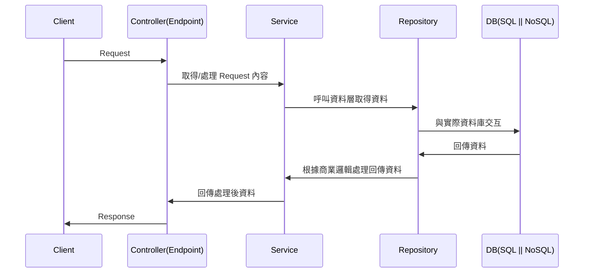
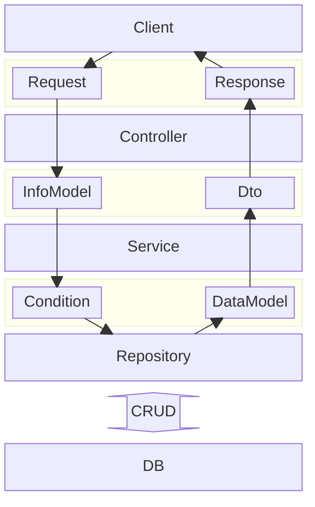

## N-Tier 架構
將應用程式劃分為多個層，每個層都有特定的職責。

### 基本概念
N-Tier 架構中的【N】代表層數，可以是 2、3、4 或更多，最常見的 N-Tier 架構是三層架構 (3-Tier)。

以【後端】的 WebApi 服務來說
- 表示層：Controller，也可以說是端點 (Endpoint)，主要用來控制對外的 Endpoint 和 Request 處理相關邏輯 (Binding or Validate...)，並且決定要呼叫哪一個 Service 的內容。
- 邏輯層：商業邏輯層，主要負責應用程式的商業邏輯。
- 資料層：負責與資料庫交互，進行資料存取和管理。

### 優點
透過每一層的定義，可以很明確且乾淨的把每層的職責分離，例如說跟實際資料庫的交互，會放在資料層；跟商業邏輯有關的是會放在邏輯層。  
部分情況下也會有部分商業邏輯存在於資料層的狀況 (可能是為了效能或是其他考量...等)，但這並不影響整個架構所帶來的明確性與可維護性。

- 模組化：每個層都有明確的職責，方便開發和維護。
- 重用性：邏輯層和資料層可以被不同的表示層重用，提升了系統的可重用性。
- 獨立性：可以獨立地調整或是擴展某一層，而不影響其他層。

### 缺點
- 過度設計：雖然三層看起來很明確，但對於非常簡單的功能來說，分層會將簡單的事情複雜化，例如只是需要透過 OrderId 取得 Order 資料，需要把三層都建立好才可以使用。
- 難以控制複雜度：當系統變得複雜，或是各式各式的邏輯加入系統中，可能會讓一個 Endpoint 會需要使用到多個 Service 或是一個 Service 會使用到多個 Repository 來做處理，雖然 **重用性** 本應該是這個架構的優點，但是當功能變得複雜時，修改單一方法的影響層面會隨之變大，因為共用這個方法的地方太多，調整時就必須要相容之前的作法，可能會讓複雜度增加。

## Layer Definition

### 表示層 (Presentation Tier)
表示層是前端與系統的介面，它主要負責回傳資料並接收使用者輸入。

### 邏輯層 (Logic Tier)
邏輯層處理應用程式的商業邏輯，是應用程式的核心部分。它接收來自表示層的請求，處理商業邏輯，並將結果返回給表示層。  
邏輯層也可以調用資料層來讀取或寫入資料。

### 資料層 (Data Tier)
資料層負責資料的持久化，它與資料庫交互，執行資料的存取操作。

## 實作架構圖
