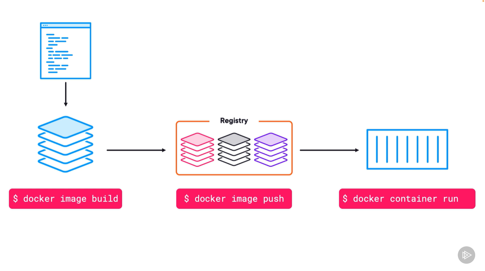

## Big Picture

## SourceCode
> 包含應用程式相關的程式碼，其中`dockerfile`，是用來建置 docker image 使用的設定檔。

## 建置
> 將應用程式和相依的所有檔案，把包成單一個 image file。

## 存放
> 將 image 放到專門儲放地方 (Registry)。
> 可以做版本管理，標籤...等，同時可以管理多個 image。

## 執行
> 啟動容器化應用。