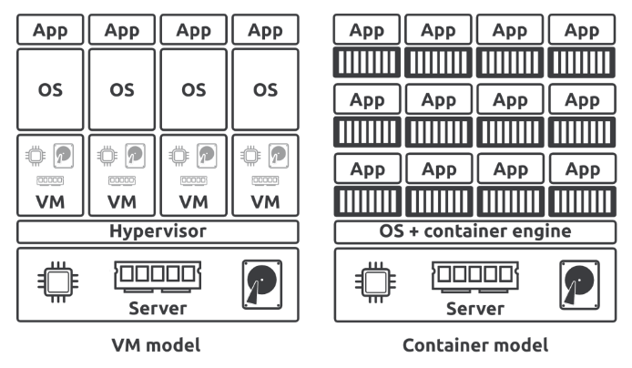

## 起源
每當企業需要一個新應用程序時，就必須購買一台新伺服器。不幸的是，我們不擅長預測新應用程序的性能需求，只能猜測未來可能的使用量。

這導致企業傾向購買非常昂貴的伺服器，性能遠超應用程序的需求。畢竟，沒有人希望伺服器性能不足，無法處理應用程序，從而導致客戶不滿和收入損失。因此，企業最終擁有許多性能過剩的伺服器。

直到虛擬化技術出現後，解決了這個問題。

## Virtual Machine
VMware的出現，終於有了一種技術，允許我們在一個伺服器上安全地運行多個應用程式。

這是一個改變遊戲規則的技術。企業可以在現有伺服器的閒置資源上運行應用，這掀起了一個最大化現有資產價值的黃金時代。

1. 特點
   - 每個虛擬機都有完整的 OS 和配置的硬體資源 (CPU, RAM)。
   - 每個虛擬機都相當於是獨立的作業系統。
2. 缺點
   - 每個虛擬機都包含完整的系統，啟動的資源需要比較多，
   - 因為是完整的系統，所以啟動的速度也比較慢。
   - 每個虛擬機都需要定時監控和更新。

## Container
容器共享其運行的主機的 OS，這意味著單個主機可以運行更多的容器，同時每個容器並非獨立的作業系統，可以更高效的使用伺服器資源，啟動更快速。

- Linux Container
現代容器技術始於 Linux，是眾多人多年來共同努力的成果。例如，Google為Linux內核貢獻了許多與容器相關的技術。正是由於這些貢獻，我們才有了今天的容器。

:::info
注意：許多類似於容器的技術早於 Docker 和現代容器。然而，沒有任何一個像 Docker 一樣，讓使用容器變得很容易。
:::

## Docker
Docker 是使 Linux Container 易於使用的工具。

## Docker on Windows
微軟的 WSL ，透過內建 Linux 核心的方式，使得在 Windows 上面執行 Linux Container 變得很容易。  
雖然 Windows 本身也有自己的容器技術(Windows Container)，但最主流的還是 Linux Container。

## WebAssembly
WebAssembly(Wasm) 是一種現代二進制指令集，用於構建比容器更小、更快、更安全、更便攜的應用程式。  
可以用自己喜歡的程式語言建置，並將其編譯為 WASM binary，就可以在任何有 Wasm-Runtime 的地方執行。

:::warning
目前 WASM還有許多限制，許多標準都還在開發訂製。  
容器生態也比 WASM 生態更豐富、更成熟。
:::

## Kubernetes
Kubernetes 是部署和管理容器化應用的標準平台。

:::info
Kubernetes 雖然不是管理容器的唯一選擇，但目前主流幾乎都以 Kubernetes 作為管理的工具。
:::

## Reference
https://leanpub.com/dockerdeepdive