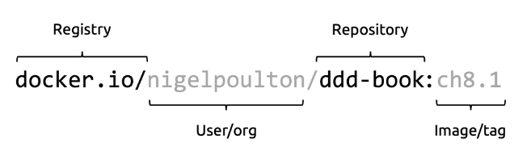

## Standards
談到技術就必須先說標準，有了標準，大家才能夠在相同的規格下各自發展良性競爭，作為使用者，也可以在相同規格下，有更多的工具可以選擇。

- [The Open Container Initiative (OCI)](#the-open-container-initiative-oci)

## The Open Container Initiative (OCI)
定義容器底層相關的規格。

1. The [image-spec](https://github.com/opencontainers/image-spec)
2. The [runtime-spec](https://github.com/opencontainers/runtime-spec)
3. The [distribution-spec](https://github.com/opencontainers/distribution-spec)

## Docker technology
Docker 主要提供的元件可以分為兩部分
- Client: 主要負責提供 API，讓使用者操作容器的事務。
- Server(Engine): 主要負責容器的生命週期和建置啟動...等。

## Docker Engine
Docker Engine 是由多個元件組合而成的，
- RUNC: Interface with kernel
- shim: Enables pluggable lower level
- containerd: Lifecycle management
- daemon: Expose API
- CLI: Command Line

### dokcer daemon (dockerd)
dockerd 是管理容器的主要服務。主要負責處理來自 Docker CLI 的 API 請求。

### containerd
containerd 是一個高性能的 container-runtime，它提供建置和管理容器所需的基本功能。  
它負責處理低層次的容器操作，如啟動和停止容器、拉取和推送 image 等。
(實際上是將 image 轉換為 OCI bundle，告訴 runc 執行)

起初是讓 containerd 成為一個專門管理容器生命週期事件的工具。然而，現在已經擴展到包括管理映像、網絡和卷的能力，可以協助類似 Kubernetes 這樣的專案執行工作。  

### shim
Shim 為 containerd 和 runc 之間提供了一個抽象層，使容器成為 Daemonless Container。  
當 containerd 和 runc 解耦，可以在不影響已運行容器的情況下，單獨更新 daemon 或是 containerd。

### RUNC
runc 是實際建立和執行容器的底層 runtime。它是根據 OCI 規範實現的，確保了容器的標準化。  
runc 負責處理容器的所有細節，如設置命名空間、控制組、掛載文件系統等。

## Docker Image
Docker Image 可以將其理解為一組 vm-template，裡面包含啟動應用所需的內容。(ReadOnly)  
Docker 可以透過這個 Image 來啟動一組或是多組的應用。

Docker Image 的多層結構允許層之間的共享和重用。每一層都有自己的 Hash Value，當我們 pull image 下來時，會檢查 layer 是否已經存在，就不需要再 pull 下來。  
(Sharing image layers)

### Base Layer
> 所有的 Docker Image 都是從 Base Layer 往上添加新層。

### Merge Layer

上層的文件可以選擇覆蓋下層的文件，透過多重合併的機制，可以確保每一層的獨立，又可以根據需要添加多層文件，簡化每一層的邏輯。

### Hashes
同一個標籤也可能會是不同版本的 Image，所以需要使用 Hash，來讓我們可以識別版本內容是否有差異。  
- Images digests: Image Manifest File 的 Hash。
- Layer digests: Layer Contents 的 Hash。

1. Content hashes: 未壓縮的 Hash。
2. distribution hashes: 壓縮的 Hash。(減少網路流量)

### Multi-Architecture
1. 清單列表
2. 清單
透過這兩個資訊，可以知道對應不同架構下，需要的不同 Layer 資訊，從而透過一個 image，建立不同架構下的應用程式。

### 命名和標籤

## Docker Continaer

### 虛擬機 vs 容器

| VirtualMachine | Container      |
| -------------- | -------------- |
| 對硬體做虛擬化 | 對 OS 做虛擬化 |
| 啟動時間長     | 啟動時間短     |
| 攻擊面較大     | 攻擊面較小     |

## 佈署和管理容器

| Docker Compose                       | Docker Swarm       | Docker Stack                      |
| ------------------------------------ | ------------------ | --------------------------------- |
| 透過 YAML 檔設定，減少冗長的 command | 可擴展的容器集群   | 結合 Compose 和 Swarm 的特性      |
| 單台主機上面的容器管理               | 提供高可用和高擴展 | 可以使用 Compose 格式檔案佈署到集群 |
| 不適合用於大規模佈署                 |                    |                                   |

## Docker Network

Docker Network 提供了多種 Network 模式，可以根據需求彈性地配置容器間的通訊方式。

| Host                         | Birdge Networks                                        | Overlay Network                 | None             |
| ---------------------------- | ------------------------------------------------------ | ------------------------------- | ---------------- |
| 與主機共享相同的網路介面和埠 | 類似區域網路 (最常見的類型)                            | 類似 VPN，可以跨不同的主機通訊  | 容器不含網路功能 |
|                              | 可以建立自定義的 BridgeNetwork，限制不同組容器間的通訊 | 可以使用 TLS 加密來保護網路流量 |                  |

## Volumn

Volume 是一個獨立於容器生命週期的儲存空間，讓容器可以儲存持久性資料。它就像是容器的外部硬碟，即使容器被刪除，Volume 和其中的資料仍然會保留下來。

### 特點

- 獨立性：Volume 是獨立的物件，不受容器生命週期的影響。
- 靈活性：可以將 Volume 映射到專用的外部儲存系統，例如雲端或地端的儲存設備。
- 共享性：不同容器可以透過 Volume 來存取和共用相同的資料。

## Reference
https://leanpub.com/dockerdeepdive