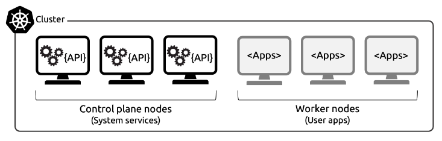
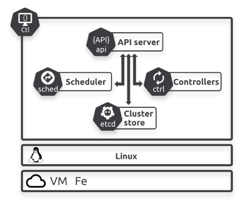
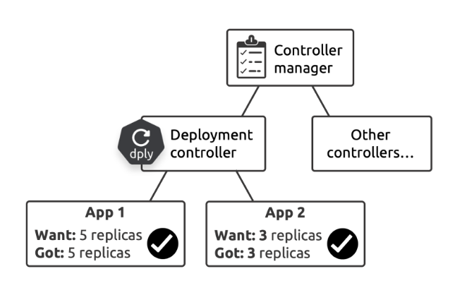
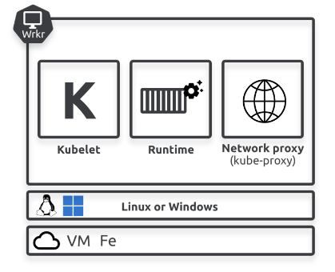
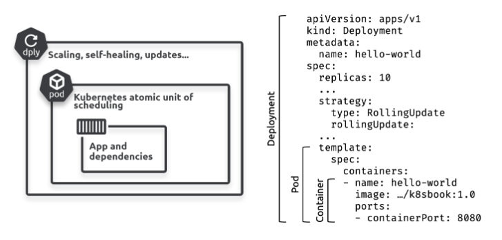
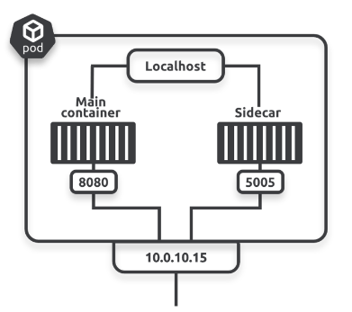

## Overview

Kubernetes 包含下面兩種內容。

1. 叢集 (cluster)
2. 協調器 (orchestrator)

### Cluster

由單個或是多個節點 (Nodes) 組成，提供 CPU、記憶體、和其他運算資源給應用程式使用。

### Nodes
- Control plane  
每個 Cluster 至少需要一個，建議設置多個來達到 HA 的效果。
:::info
相當於大腦，負責控制所有的核心服務執行和容器調度。
:::

- Worker:  
執行容器化應用的地方

## Control Plane

### API Server

Kubernetes 的前端，所有的請求，不管是更改/查詢叢集狀態，或是內部服務溝通，┬都會透過`API Server`處理。

`API Server`提供 RESTful API 和 Https，所有的請求都會要通過驗證 + 授權。

### Cluster Store

儲存所有應用和叢集元件的期望狀態，是`Control Plane`中唯一有狀態的部分。

### Controllers & Controller Manager

### Scheduler

1. 監控`API Server`確認是否有新任務。
2. 確認可以指派的節點。
3. 指派任務到結點上。

## Worker Nodes

### Kubelet

Kubernetes agent，負責與叢集的所有溝通。

- 監控`API Server`確認是否有新任務。
- 回報`API Server`任務執行結果。

### Runtime

每一個工作節點 (Worker) 都可以有單個或是多個`Runtime`來執行任務。

### Kube-proxy

每一個工作節點 (Worker) 都有一個`Kube-proxy`來處理叢集網路和節點內的任務負載平衡。

## Packaging For K8s

### Pods

Pod 是 K8s 的最小單位，一個 Pod 可以有多個 Container，同一個 Pod 內的容器，彼此共享執行環境 (`execution environment`)。

### Pod Lifecycle

Pods 是有生命週期的，它們被建立、使用，然後回收。每當一個 Pod 回收，Kubernetes 會用一個新的替代它。

### Pod immutability

應該始終使用新的 Pod 來替換舊 Pod，而不是透過登錄到 Pod 上面做更改。

### Declarative Model

Kubernetes 使用聲明式模型來管理應用程式，意味著只需描述好的應用程式狀態，而 Kubernetes 會負責實現它。

## Reference
https://leanpub.com/thekubernetesbook