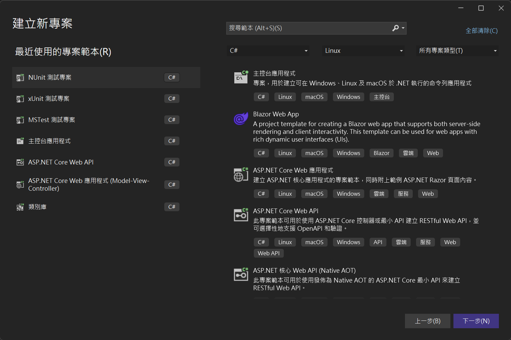
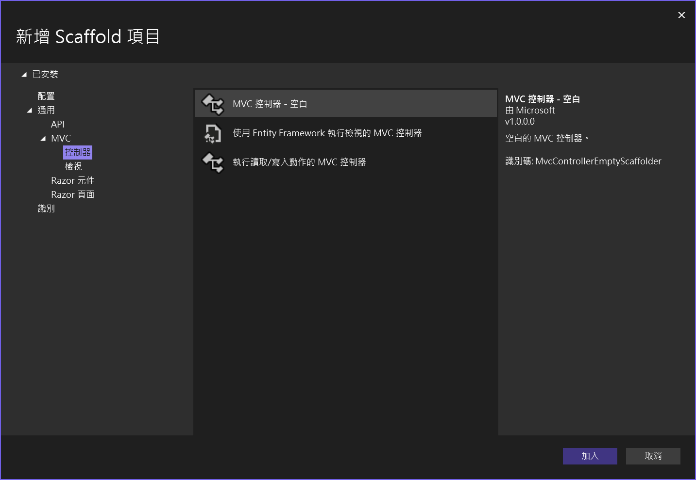
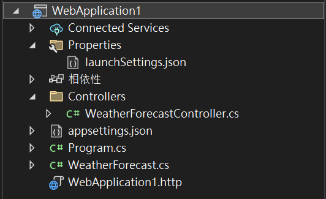
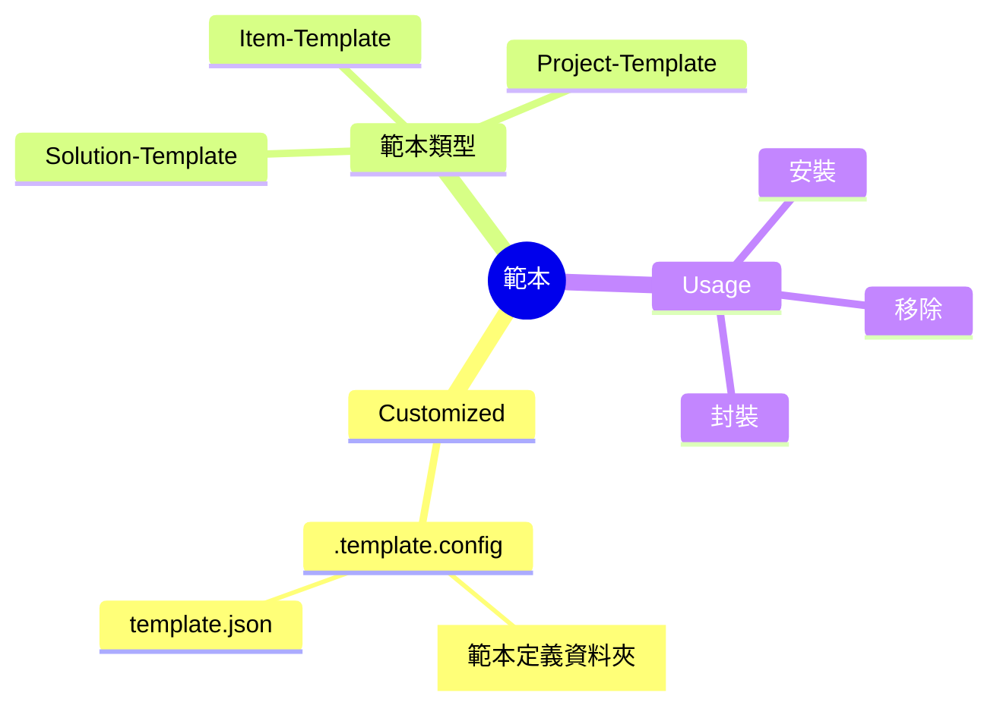

## 介紹

### 什麼是範本
預先定義好的 程式碼/專案/方案，當有類似的需求，拿現有的範本進行調整，可以更快的進入開發。

微軟官方依直以來都幫大家定義好各式各樣的範本，開發人員只要針對要開發的類型進行選擇，就可以得到相對應的初始結構。

例如打開 Visual Studio 建立新專案，可以看到各式各樣的範本已經內建在裡面。

### 為何需要自定義範本
不管團隊或個人，可能都會有各自習慣的開發風格和需求，透過自定義範本，可以一開始就把希望用到的結構或是套件都先定義好，不需要每次做新專案的時候都從頭來過。

### 範本類型
[MSLearn](https://learn.microsoft.com/zh-tw/dotnet/core/tutorials/cli-templates-create-item-template) 上面只有介紹兩種範本但實際上要做出方案範本也是可行的。

1. Item Template
   > 檔案範本，可以搭配參數 (檔名) 做到類似內建 Scaffold 的效果。  
   > (透過 CLI)
    
    

2. Project Template
    > 專案範本，類似 Console 或是 WebApi 的初始專案一樣，可以把專案需要的東西一併設定在這個範本內範本內。

    

3. Solution Template
    > 可以將整個解決方案做成範本，對於團隊來說，可以很方便將開發架構做成方案範本，方便大家使用。

## Mindmap

