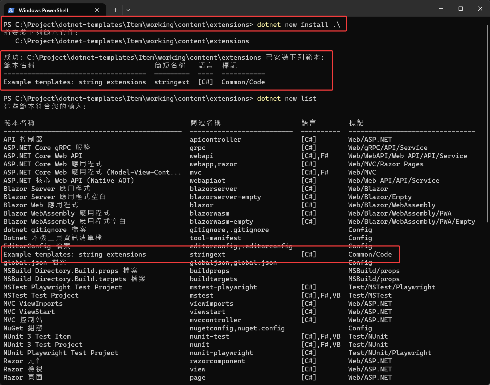
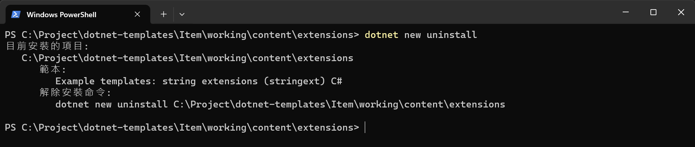
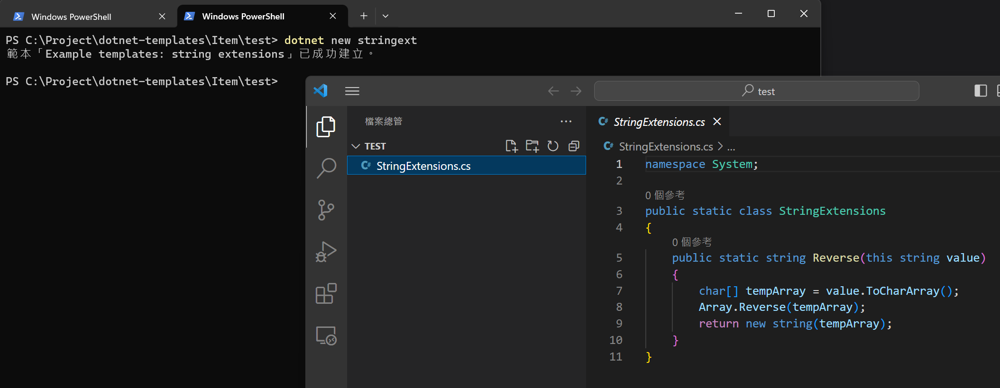
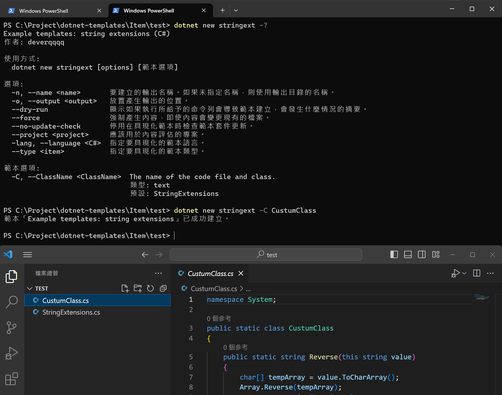

import Tabs from '@theme/Tabs';
import TabItem from '@theme/TabItem';

## 目標：建立第一個 Item Template

> 建立一個 String 的擴充方法，並做成範本

### 目錄結構

```
parent_folder
├───test (測試使用)
└───working
    └───content
        └───extensions
```

### 建立範本檔案 + 設定檔案

更多設定項目可以參考 [[說明]](09_conf.md)
```
parent_folder
├───test (測試使用)
└───working
    └───content
        └───extensions
            └───StringExtensions.cs
            └───.template.config
                └───template.json
```

<Tabs>
  <TabItem value="StringExtensions.cs" label="StringExtensions.cs" default>

    ```csharp
    namespace System;

    public static class StringExtensions
    {
        public static string Reverse(this string value)
        {
            char[] tempArray = value.ToCharArray();
            Array.Reverse(tempArray);
            return new string(tempArray);
        }
    }
    ```
  </TabItem>

  <TabItem value="template.json" label="template.json">

    ```json
    {
        "$schema": "http://json.schemastore.org/template",
        "author": "deverqqqq",
        "classifications": [
            "Common",
            "Code"
        ],
        "identity": "ExampleTemplate.StringExtensions",
        "name": "Example templates: string extensions",
        "shortName": "stringext",
        "tags": {
            "language": "C#",
            "type": "item"
        },
        "symbols": {
            "ClassName": {
                "type": "parameter",
                "description": "The name of the code file and class.",
                "datatype": "text",
                "replaces": "StringExtensions",
                "fileRename": "StringExtensions",
                "defaultValue": "StringExtensions"
            }
        }
    }
    ```
  </TabItem>
</Tabs>

## 安裝

```sh
# 將 cursor 移動到範本資料夾
cd /your-template-path

# 安裝
dotnet new install .\

# 查看可以用的範本
dotnet new list

# 查詢已安裝的項目
dotnet new uninstall
```

:::tip
安裝後如果調整範本的內容，不需要重新移除後再安裝，因為本地安裝是用資料夾內的檔案作為範本的來源。
:::




### 試著用看看

使用新作好的範本來建立

1. 不使用參數

    ```sh
    dotnet new stringext
    ```
    
    

2. 查詢可使用參數

    ```sh
    dotnet new stringext -?
    ```
    

    可以看到這邊透過定義在 template.json 內的 ClassName，實現了替換類別名稱的功能。

## 移除

照著畫面的命令執行即可

```sh
# 1. 列出已安裝項目
dotnet new uninstall

# 2. 選取要移除的命令並執行
# dotnet new uninstall ....
```

## Reference

[MSLearn](https://learn.microsoft.com/zh-tw/dotnet/core/tutorials/cli-templates-create-item-template)


