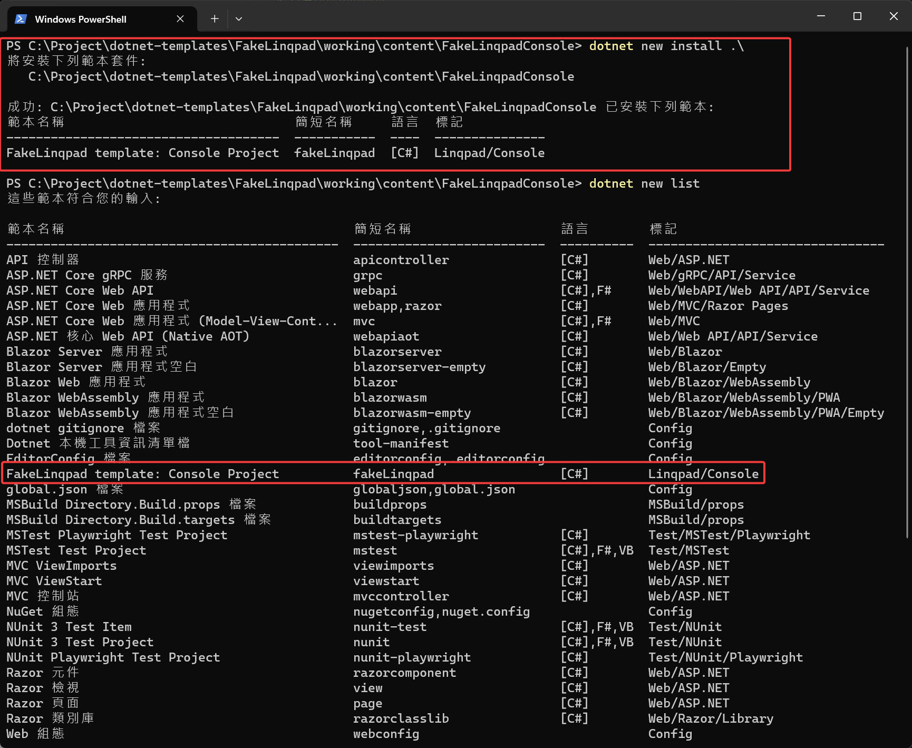
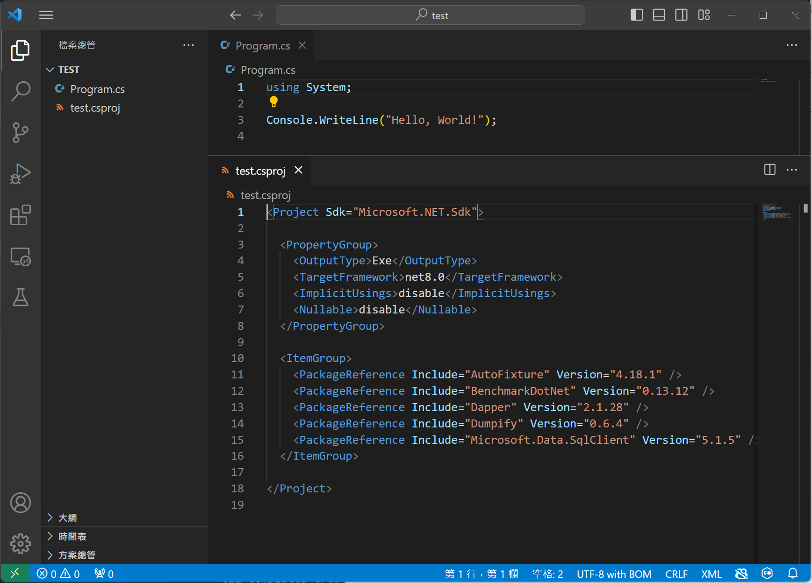
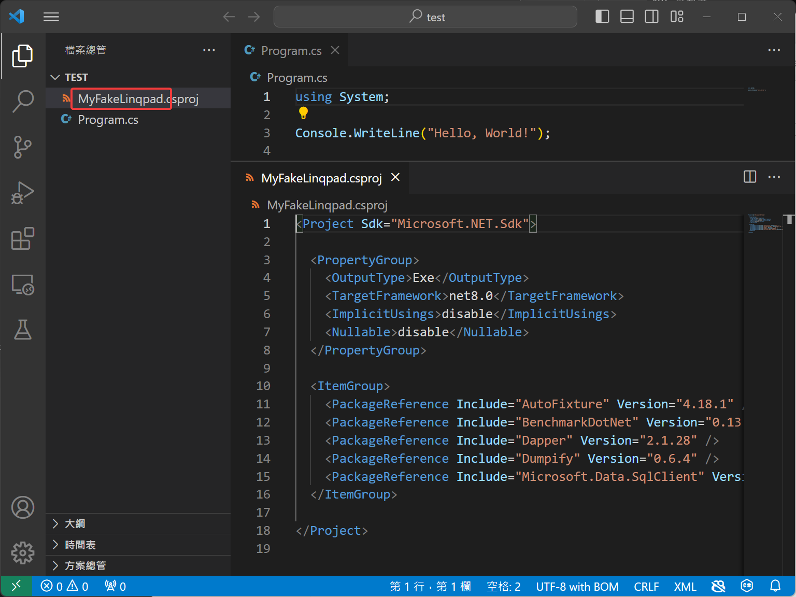
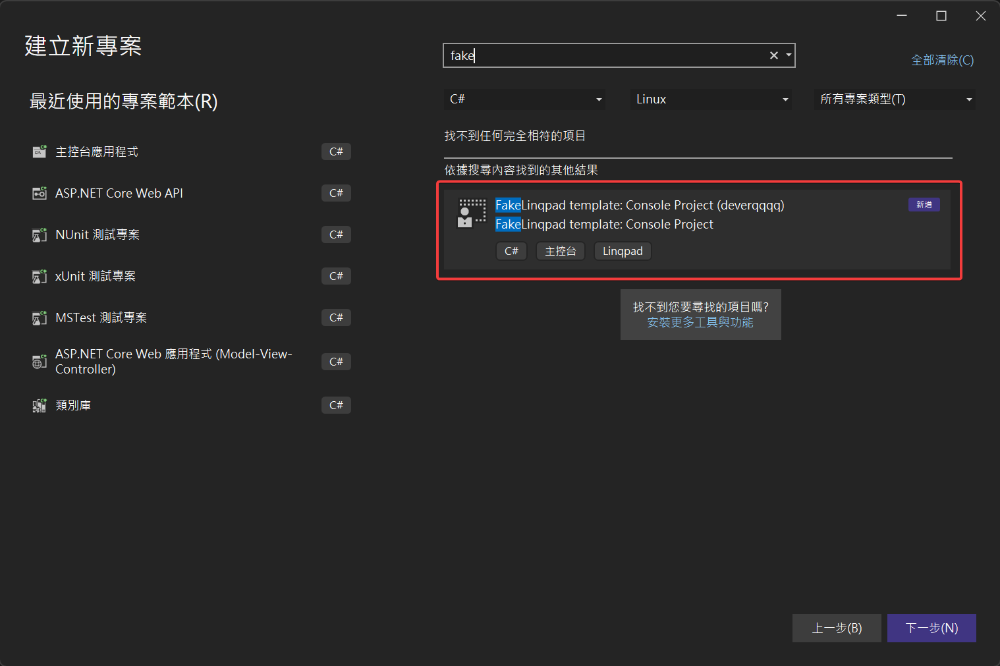
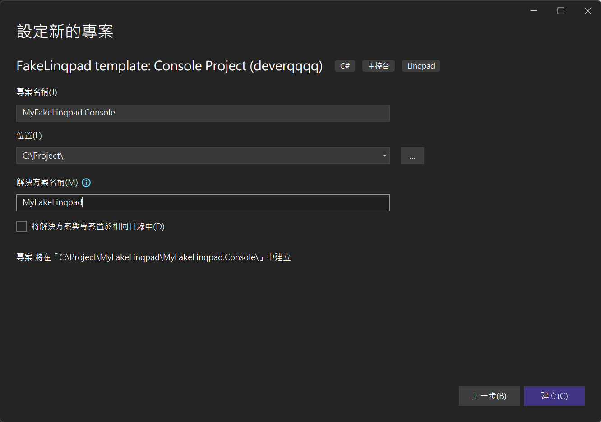
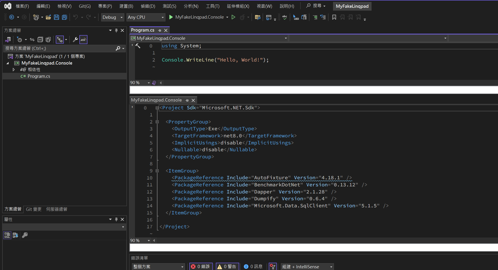

import Tabs from '@theme/Tabs';
import TabItem from '@theme/TabItem';

## 目標：建立第一個 Porject Template

> 這邊不參考 MSLearn 範例，而是做一個類似 Linqpad 的 Console 範本，在沒有 Linqpad 的狀況下，方便做 POC 或是測試。

### 目錄結構

```
parent_folder
├───test (測試使用)
└───working
    └───content
        └───FakeLinqpadConsole
```

### 建立範本檔案 + 設定檔案

1. 安裝常用的套件
    - AutoFixture
    - BenchmarkDotNet
    - Dapper
    - Dumpify
    - Microsoft.Data.SqlClient

2. 設定 sourceName，這邊設定的字串，會自動於建立範本時被取代掉，取代的值取決於`dotnet new -n xxx` 參數，如果沒有給的話預設值會是資料夾的名稱。

更多設定項目可以參考 [[說明]](09_conf.md)
```
parent_folder
├───test (測試使用)
└───working
    └───content
        └───FakeLinqpadConsole
            └───Program.cs
            └───FakeLinqpadConsole.csproj
            └───.template.config
                └───template.json
```

<Tabs>
  <TabItem value="Program.cs" label="Program.cs" default>

    ```csharp
    using System;

    Console.WriteLine("Hello, World!");
    ```
  </TabItem>

  <TabItem value="FakeLinqpadConsole.csproj" label="FakeLinqpadConsole.csproj">

    ```xml
    <Project Sdk="Microsoft.NET.Sdk">

    <PropertyGroup>
        <OutputType>Exe</OutputType>
        <TargetFramework>net8.0</TargetFramework>
        <ImplicitUsings>disable</ImplicitUsings>
        <Nullable>disable</Nullable>
    </PropertyGroup>

    <ItemGroup>
        <PackageReference Include="AutoFixture" Version="4.18.1" />
        <PackageReference Include="BenchmarkDotNet" Version="0.13.12" />
        <PackageReference Include="Dapper" Version="2.1.28" />
        <PackageReference Include="Dumpify" Version="0.6.4" />
        <PackageReference Include="Microsoft.Data.SqlClient" Version="5.1.5" />
    </ItemGroup>

    </Project>
    ```
  </TabItem>

    <TabItem value="template.json" label="template.json">

    ```json
    {
        "$schema": "http://json.schemastore.org/template",
        "author": "deverqqqq",
        "classifications": [
            "Linqpad",
            "Console"
        ],
        "identity": "deverqqqq.FakeLinqpadConsole",
        "name": "FakeLinqpad template: Console Project",
        "shortName": "fakeLinqpad",
        "sourceName": "FakeLinqpadConsole",
        "tags": {
            "language": "C#",
            "type": "project"
        }
    }
    ```
  </TabItem>
</Tabs>

## 安裝

```sh
# 將 cursor 移動到範本資料夾
cd /your-template-path

# 安裝
dotnet new install .\

# 查看可以用的範本
dotnet new list

# 查詢已安裝的項目
dotnet new uninstall
```

:::tip
安裝後如果調整範本的內容，不需要重新移除後再安裝，因為本地安裝是用資料夾內的檔案作為範本的來源。
:::



### 試著用 CLI 使用剛剛建立好的範本

1. 不使用參數
> 預設使用資料夾名稱替換 csproj 檔名

    ```sh
    dotnet new fakeLinqpad
    ```
    
    

2. 查詢可使用參數
    > 使用參數`MyFakeLinqpad`名稱替換 csproj 檔名

    ```sh
    dotnet new fakeLinqpad -n MyFakeLinqpad
    ```

    

    可以看到這邊透過定義在 template.json 內的 ClassName，實現了替換類別名稱的功能。

### 試著用 Visual Studio 2022 使用剛剛建立好的範本

1. 打開 VS2022 找到剛剛建立的範本
   

2. 設定專案名稱
   

3. 確認結果
   

## 移除

照著畫面的命令執行即可

```sh
# 1. 列出已安裝項目
dotnet new uninstall

# 2. 選取要移除的命令並執行
# dotnet new uninstall ....
```

## Reference

[MSLearn](https://learn.microsoft.com/zh-tw/dotnet/core/tutorials/cli-templates-create-project-template)


