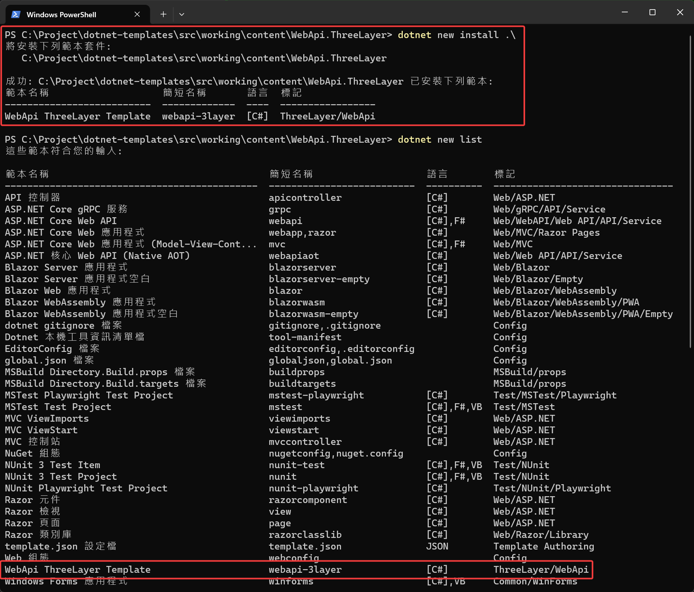
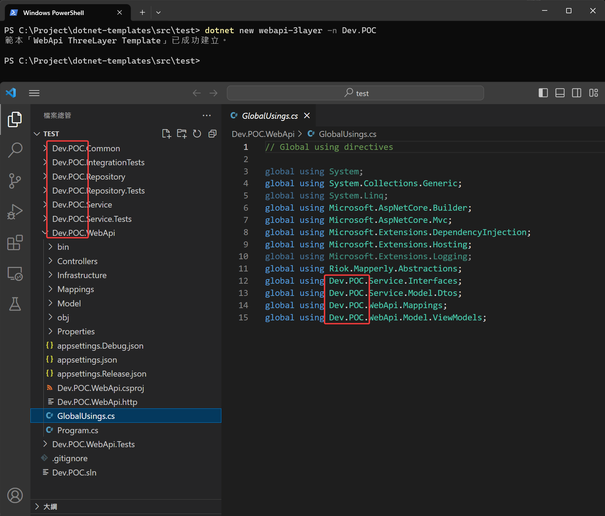
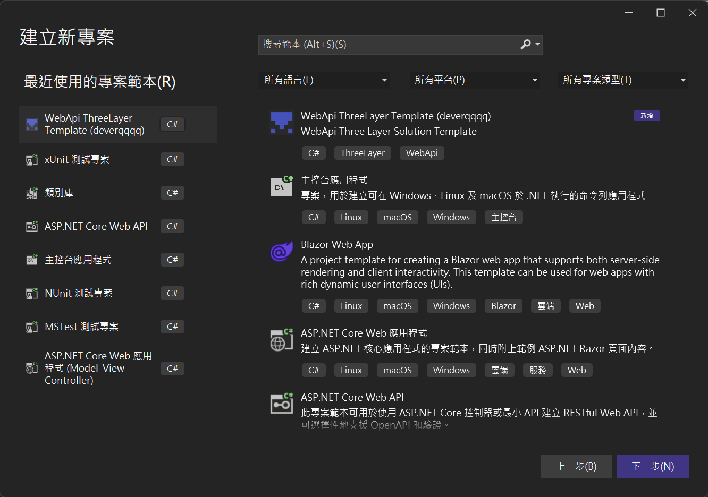
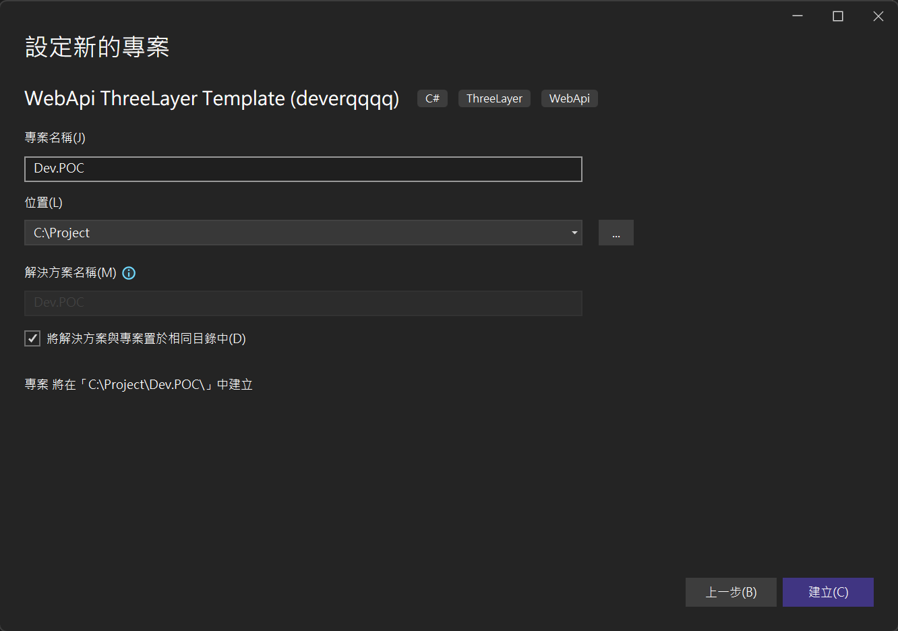
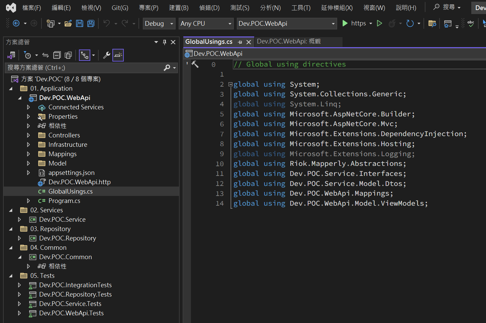

import Tabs from '@theme/Tabs';
import TabItem from '@theme/TabItem';

## 目標：建立第一個 Solution Template

> 這邊以自建三層架構的 webapi 範本為目標。

### 目錄結構

```
parent_folder
├── test
└── working
    ├── README.md
    ├── content
    │   └── WebApi.ThreeLayer
    │       ├── Template.Common
    │       ├── Template.IntegrationTests
    │       ├── Template.Repository
    │       ├── Template.Repository.Tests
    │       ├── Template.Service
    │       ├── Template.Service.Tests
    │       ├── Template.WebApi
    │       ├── Template.WebApi.Tests
    │       └── Template.sln
    └── deverqqqq.Templates.csproj
```

### 設定範本內容

1. 安裝各層常用套件
2. 設定 sourceName，這邊設定的字串，會自動於建立範本時被取代掉，取代的值取決於`dotnet new -n xxx` 參數，如果沒有給的話預設值會是資料夾的名稱。
3. 設定好 guids，範本產生的過程，會把相符合的都替換掉 (替換專案 guid，避免 template 每次產生都是相同的 guid)。
4. 設定 sources，排除不必要的目錄，本地安裝或是開發會很方便。

<Tabs>

  <TabItem value="template.json" label="template.json">

    ```json
    {
        "$schema": "http://json.schemastore.org/template",
        "author": "deverqqqq",
        "classifications": [
            "ThreeLayer",
            "WebApi"
        ],
        "identity": "deverqqqq.WebApi.ThreeLayer",
        "name": "WebApi ThreeLayer Template",
        "description": "WebApi Three Layer Solution Template",
        "shortName": "webapi-3layer",
        "sourceName": "Template",
        "guids": [
            "353B937D-6D7F-4A7C-9877-FDECFE7ED7BB",
            "1B7F6882-AA33-4C00-80C5-47B42A870B6D",
            "28DB96A8-F37F-4039-96BE-8FC0060CBE13",
            "34541529-F348-4958-B0D8-F2A78497A58E",
            "16743C52-A75D-4349-907A-D909A6B1D25C",
            "6C274ED7-D359-44A8-B6F2-932103B1A936",
            "ED75E499-DE30-4AE7-93A0-0B56BA0BC0B8",
            "7FCA0F82-CB71-43DC-8170-3C5110A18CCE",
            "571CFF82-2688-4F30-BCC5-34B22B51DE5D",
            "B04181AF-E10E-47D7-A35D-A768A9F90C11",
            "4C68E7A1-0CF9-420E-AF4D-9919358A0FC6",
            "66680B0C-B523-4472-B0B9-D285C13C6684",
            "08A010E1-8036-4A96-B6DE-3EC9AE35DA28"
        ],
        "tags": {
            "language": "C#",
            "type": "solution"
        },
        "sources": [
            {
                "exclude": [
                    "**/[Bb]in/**",
                    "**/[Oo]bj/**",
                    ".template.config/**/*",
                    "**/*.filelist",
                    "**/*.user",
                    "**/*.lock.json",
                    ".git/**",
                    ".vs/**",
                    ".idea/**"
                ]
            }
        ]
    }
    ```
    </TabItem>
</Tabs>

## 安裝

```sh
# 將 cursor 移動到範本資料夾
cd /your-template-path

# 安裝
dotnet new install .\

# 查看可以用的範本
dotnet new list

# 查詢已安裝的項目
dotnet new uninstall
```

:::tip
安裝後如果調整範本的內容，不需要重新移除後再安裝，因為本地安裝是用資料夾內的檔案作為範本的來源。
:::



### 試著用 CLI 使用剛剛建立好的範本

1. 透過範本快速建立方案

    ```sh
    dotnet new webapi-3layer -n Dev.POC
    ```
    
    

### 試著用 Visual Studio 2022 使用剛剛建立好的範本

1. 打開 VS2022 找到剛剛建立的範本
   

2. 設定專案名稱
   

3. 確認結果
   

## 移除

照著畫面的命令執行即可

```sh
# 1. 列出已安裝項目
dotnet new uninstall

# 2. 選取要移除的命令並執行
# dotnet new uninstall ....
```
