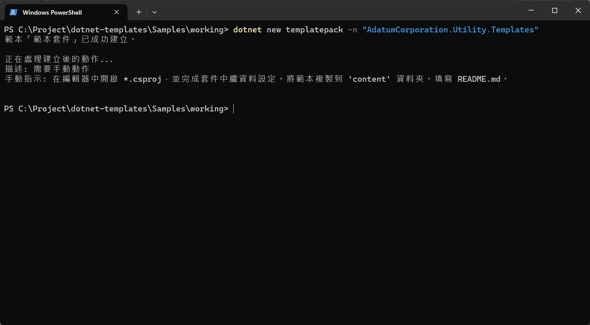
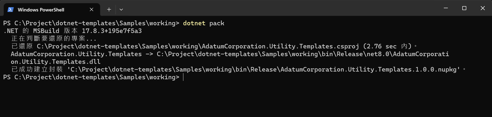
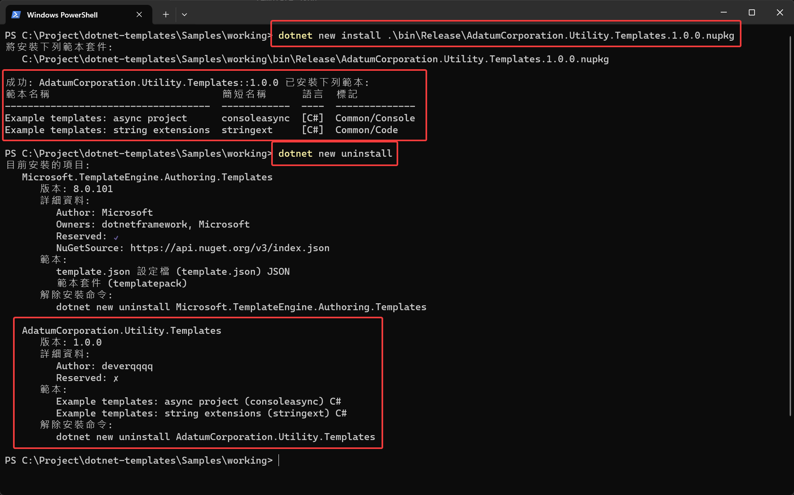

import Tabs from '@theme/Tabs';
import TabItem from '@theme/TabItem';

## 開始之前

1. 安裝範本封裝工具
   ```sh showLineNumbers
   dotnet new install Microsoft.TemplateEngine.Authoring.Templates
   ```

2. 這邊參考了官方的作法，確保範本內容與官方的一致
    ```
    content
    ├───extensions
    │   └───StringExtensions.cs
    │   └───.template.config
    │           template.json
    └───consoleasync
        └───Program.cs
        └───consoleasync.csproj
        └───.template.config
                template.json
    ```

## TemplatePack

### 在 working 中，建立封裝的 .csproj 定義檔

```sh showLineNumbers
dotnet new templatepack -n "AdatumCorporation.Utility.Templates"
```



簡單調整
```xml showLineNumbers
<Project Sdk="Microsoft.NET.Sdk">

  <PropertyGroup>
    <!-- The package metadata. Fill in the properties marked as TODO below -->
    <!-- Follow the instructions on https://learn.microsoft.com/en-us/nuget/create-packages/package-authoring-best-practices -->
    <PackageId>AdatumCorporation.Utility.Templates</PackageId>
    <PackageVersion>1.0</PackageVersion>
    <Title>SampleTemplatePackage</Title>
    <Authors>deverqqqq</Authors>
    <Description>這是一個範例的範本封裝</Description>
    <PackageTags></PackageTags>
    <PackageProjectUrl>https://learn.microsoft.com/zh-tw/dotnet/core/tutorials/cli-templates-create-template-package?pivots=dotnet-8-0</PackageProjectUrl>

    <!-- Keep package type as 'Template' to show the package as a template package on nuget.org and make your template available in dotnet new search.-->
    <PackageType>Template</PackageType>
    <TargetFramework>net8.0</TargetFramework>
    <IncludeContentInPack>true</IncludeContentInPack>
    <IncludeBuildOutput>false</IncludeBuildOutput>
    <ContentTargetFolders>content</ContentTargetFolders>
    <NoWarn>$(NoWarn);NU5128</NoWarn>
    <NoDefaultExcludes>true</NoDefaultExcludes>
    <PackageReadmeFile>README.md</PackageReadmeFile>
  </PropertyGroup>

  <PropertyGroup>
    <LocalizeTemplates>false</LocalizeTemplates>
  </PropertyGroup>

  <ItemGroup>
    <PackageReference Include="Microsoft.TemplateEngine.Tasks" Version="*" PrivateAssets="all" IsImplicitlyDefined="true"/>
  </ItemGroup>

  <ItemGroup>
    <Content Include="content\**\*" Exclude="content\**\bin\**;content\**\obj\**" />
    <Compile Remove="**\*" />
  </ItemGroup>

  <ItemGroup>
    <None Include="README.md" Pack="true" PackagePath="" />
  </ItemGroup>

</Project>

```

### 目前結構

```
working
│   AdatumCorporation.Utility.Templates.csproj
└───content
    ├───extensions
    │   └───StringExtensions.cs
    │   └───.template.config
    │           template.json
    └───consoleasync
        └───Program.cs
        └───consoleasync.csproj
        └───.template.config
                template.json
```

### 封裝

```sh showLineNumbers
# 確保目前的工作目錄在 working 資料夾內
dotnet pack
```



### 透過 nupkg 進行安裝

```sh showLineNumbers
# 安裝
dotnet new install .\bin\Release\AdatumCorporation.Utility.Templates.1.0.0.nupkg

# 目前已額外安裝項目
dotnet new uninstall
```



## 移除

照著畫面的命令執行即可

```sh showLineNumbers
# 1. 列出已安裝項目
dotnet new uninstall

# 2. 選取要移除的命令並執行
dotnet new uninstall AdatumCorporation.Utility.Templates
```

## Reference

[MSLearn](https://learn.microsoft.com/zh-tw/dotnet/core/tutorials/cli-templates-create-template-package?pivots=dotnet-8-0)


