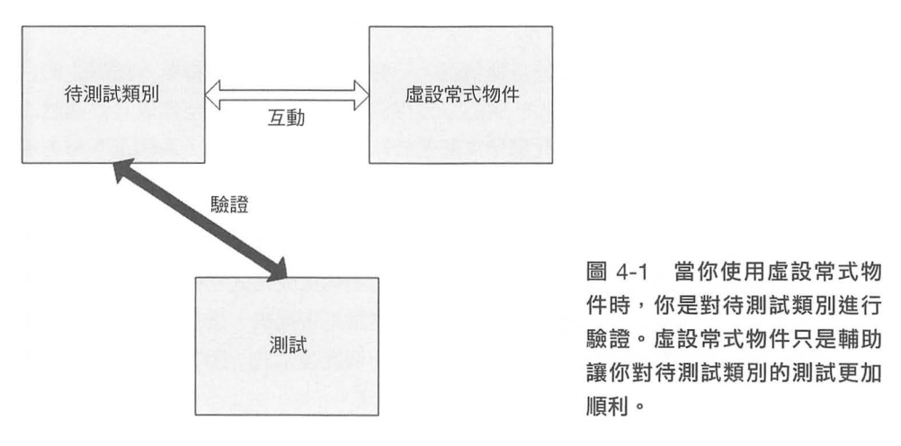
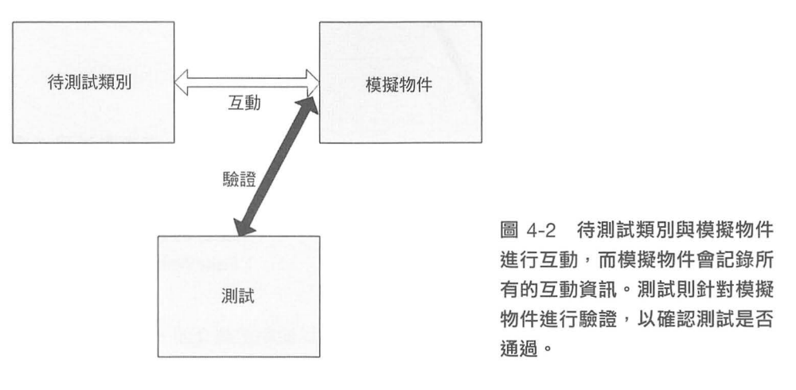

### 滿足條件

## 成功進行 TDD 的三種核心技能
1. 僅僅做到先撰寫測試，並不能保證測試是可維護、可讀且可靠的。
2. 僅僅做到撰寫出可維護、可讀、可靠的測試，並不能保證你能獲得測試先行的各種好處。
3. 僅僅做到測試先行且測試可讀、可維護、可靠，並不能保證你能產出一個設計完善的系統。

## 單元測試命名

測試類別：
`{nameof(sut)}Tests`

測試方法 :
UnitOfWorkName: 被測試的方法、一組方法或一組類別。
Scenario: 情境，例如「登入失敗」、「無效的使用者」、「密碼正確」。
ExpectedBehavior: 對被測試方法行為的預期。

## Code Convention
1. 建立測試類別、專案和方法的慣例：對每個待測試類別建立對應的測試類別，對每個待測試的專案建立 個測試專案（整合測試專案應與這種對應的測試專案分
開），對每個工作單元（可以小到是一個方法，也可以大到是幾個類別的協作）建立至少一個測試方法。
- 使用下列的 模式 以便讓你的命名 更好懂
`[UnitOfWorkl_[Scenario]_[ExpectedBehavior]`
- 使用工廠方法來讓測試能重用程式，例如那些用來初始化和建立所有測試都要使用到的物件的程式。

## 驗證目標

1. 單元測試框架運作邏輯、順序
2. 預期的回傳值
3. 預期的例外
4. 狀態驗證
5. 互動驗證 (動作驅動)

## 虛設常式 (Stub)

是在系统中產生一個可控的替代物件，來取代一個外部相依物件（或協作者）你可以在測忒程式中，透過虛改常式來遊免必須直接相依物件所造成的問題。

## 重構
在不改變程式碼功能的前提下，修改程式碼的動作。也就是說，程式碼在修改前後的功能是一致的，不多也不少，只是看起來跟原本不一樣了。

## 參考書籍

[Gerard Meszaros: xUnit Test Patterns: Refactoring Test Code](https://www.amazon.com/xUnit-Test-Patterns-Refactoring-Code/dp/0131495054)
[Dependency Injection in .NET](https://www.manning.com/books/dependency-injection-in-dot-net)
[Working Effectively with Legacy Code](https://www.tenlong.com.tw/products/9789864344000?list_name=srh)

## 虛設常式 vs 模擬物件

## 隔離 (模擬) 框架

