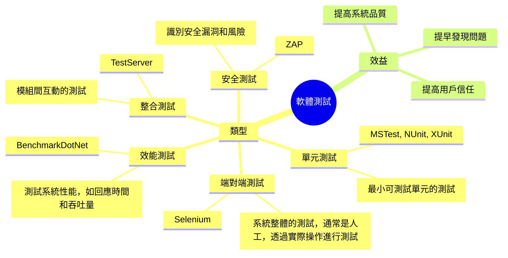

# Intro

小至一個方法，大至一個系統，當我們開發好之後，為了確保開發的內容符合預期，會進行各式各樣的測試，當後續需求變更，再次調整程式，又要把之前的測試全部在做一次，避免程式開發的過程中，不小心把本來的功能改壞。從上面的說明可以看出，但我們的系統越大，功能越複雜，要做好測試這件事情就會更困難且更費時，要如何把測試這件事情也一併的系統化與自動化，是這個單元要說明的。

## Mindmap

