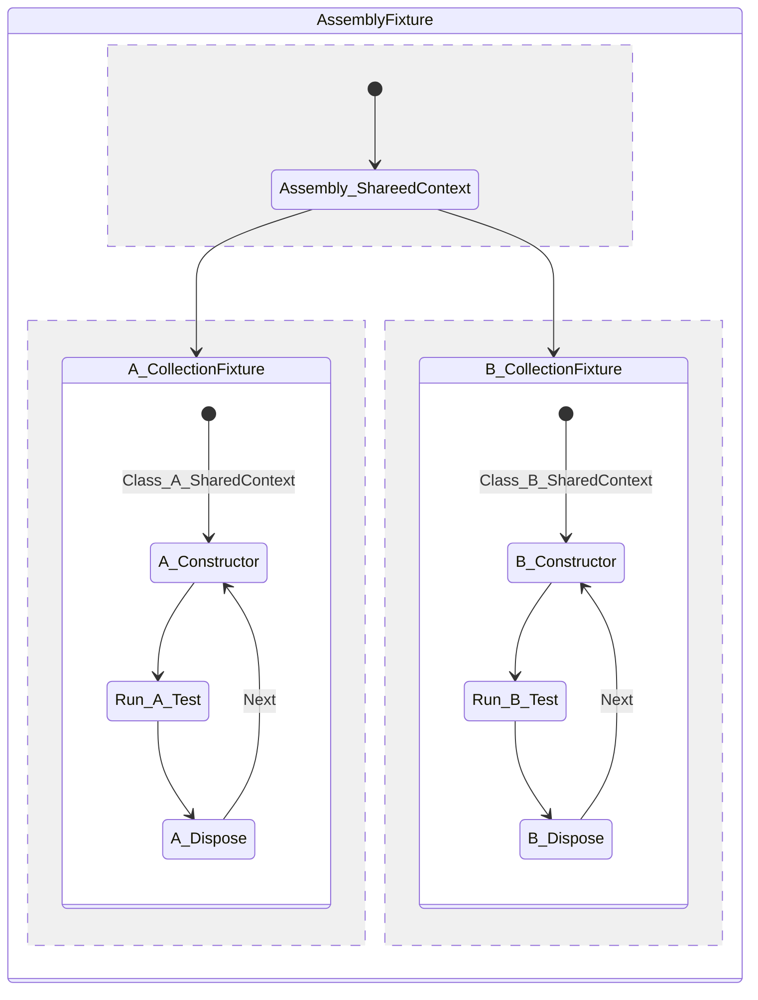

## 基本介紹
xUnit.net 是 dotnet 平台的單元測試框架之一，目前主要由 Brad Wilson 進行開發和維護。在框架設計上，我覺得相較於 mstest 和 nunit，xunit 的設計更加鼓勵你用 C# 的原生概念做到單元測試應該要做的事情，而不是透過一些額外的方式來補強。

其中有兩個我最喜歡的特性
1. 測試類別執行時，會自動為每一個測試方法都產生獨立的測試實例。  
   有助於達到測試隔離的目的，而且讓開發人員不用去擔心共用變數值的問題。當然，我們還是有需要去使用共用部分變數，但是在框架設計上先做到這件事情，反倒讓一些基本的單元測試寫起來很輕鬆也很直觀。
2. 測試的撰寫更加直觀，不再需要宣告多餘的標籤  
   例如說，如果希望在每個測試方法執行前後，都需要去處理初始化和清理的動作。
   - MSTest: 使用`TestInitialize`&`TestCleanup`
   - NUnit: 使用`SetUp`&`TearDown`
   - xUnit: 測試類別的`Constructor`&`Dispose`
    > 透過 C# 語法的基本概念，結合單元測試觀念，直接透過`Constructor`&`Dispose`處理，不需要寫額外的標籤，讓整個測試看起來更加的簡單直覺。
    
## 重點觀念

1. 語意化標籤  
`[Fact]`：表示驗證事實，可以獨立進行測試。
`[Theory]`：表示情境，通常搭配`[InlineData]`或是`[MemberData]`使用，透過多種設定好的參數組合來驗證結果。

2. 平行執行  
預設情況下，不同的測試類別會同時執行，增加單元測試的效率。  
如果希望不同的測試類別不啟動平行執行，可以透過設定同一個測試集合 (Collection) 來避免。

3. Shared Context  
- Constructor and Dispose: 不同的測試方法共享初始化和清理邏輯，沒有其他共享物件。
- Class Fixtures: 在同一個測試類別內，多個測試方法間共享物件實體。
- Collection Fixtures: 在同一個測試集合內，多個測試類別間共享物件實體。
- Assembly Fixtures: 整個測試組件內共享物件實體。

## 流程

## 使用

## Reference
[xUnit](https://xunit.net/)  
[xUnit-Github](https://github.com/xunit/xunit)
