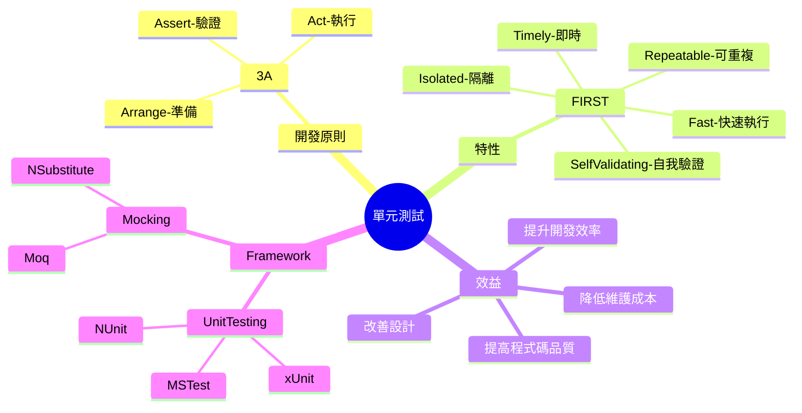
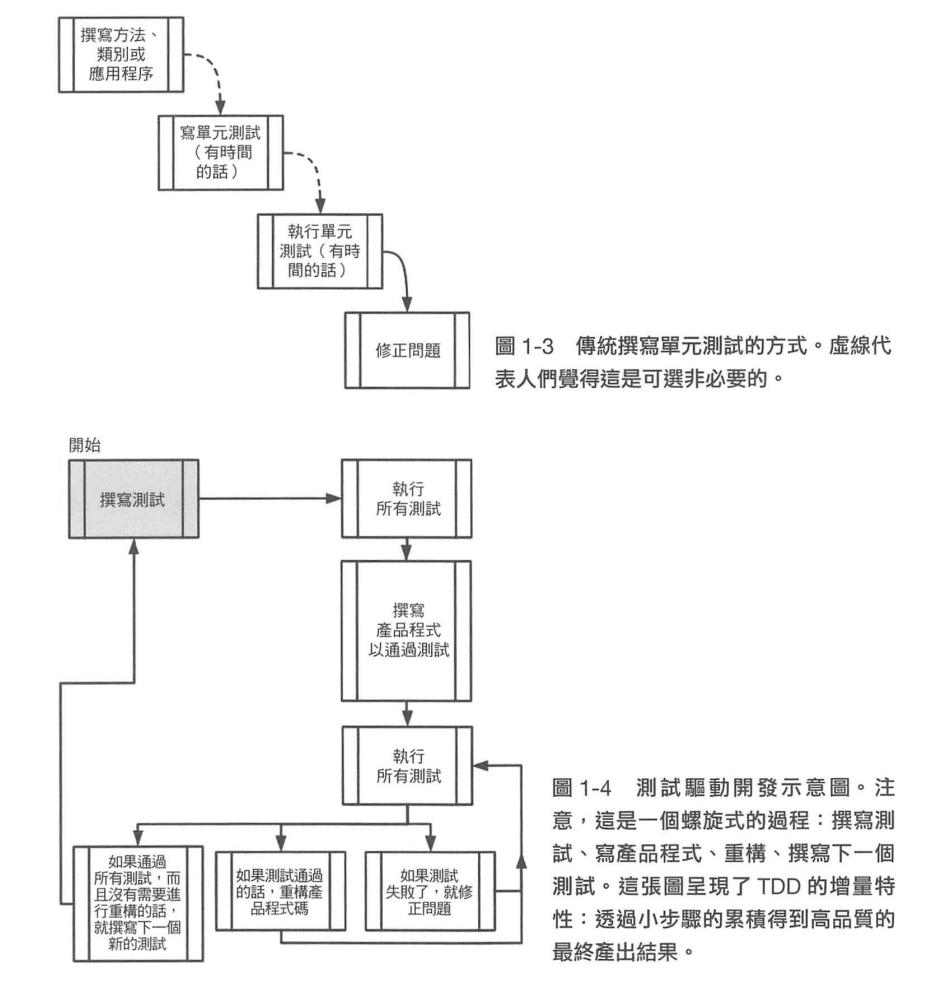

## 介紹
> 單元測試是一種軟體開發測試，旨在對程式碼的最小可測試部分（通常是方法或函數）進行隔離檢查以確保它們正確執行。單元測試的核心概念是將系統拆分成可獨立測試的最小單元，並且對每個單元進行嚴格的、自動化的測試。

## Mindmap

## 效益

### 單元測試能給我們帶來什麼

- 提高程式碼品質：通過對各個單元的測試，可以在功能驗收/上線前發現並修正錯誤，有助於減少後期的 bug 修復成本。
- 促進重構 (Refactor)：擁有一套穩定的單元測試，可以使開發人員在重構時更有信心，確保重構不會引入新的錯誤。
- 改善設計 (Testability)：為了使單元測試更加容易撰寫，開發人員通常會採用更模組化的設計，同時也避免模組間的高度耦合 (減少依賴)，有助於提高可讀性和可維護性。
- 提升開發效率：單元測試提供了快速的反饋機制，開發人員可以立即知道新加入的功能或是修改是否影響了現有功能。
- 支持自動化：單元測試可以輕鬆整合到 (CI/CD）流程中，實現自動化測試。
- 文件化：良好的單元測試可以作為代碼的實時文檔，幫助新成員理解代碼庫的功能和使用方式。

### 衍生：TDD-測試驅動開發

> 透過多次的單元測試，採取先撰寫測試在開發功能的模式，可以快速發現問題並修正，也不會過早進行 Production Code 的設計。

### 單元測試無法解決的問題
- 整合錯誤 (Integration Error)：單元測試關注於單個工作單元或功能，無法捕捉到模組之間整合時可能出現的問題。
- UI/UX 問題：無法評估產品的用戶界面和用戶體驗是否符合預期。
- 性能問題：單元測試不涉及性能測試，無法識別系統在高負載下的表現。
- 安全性問題：通常不包括對安全漏洞的檢測，如 SQL 注入、跨站腳本 (XSS) 等安全威脅。

## Reference
[單元測試的藝術](https://www.tenlong.com.tw/products/9789864342471?list_name=c-unit-test)