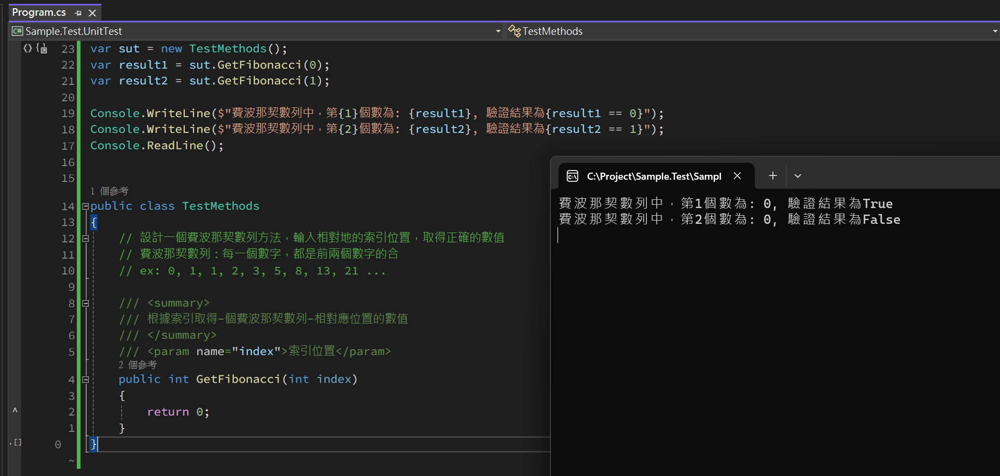
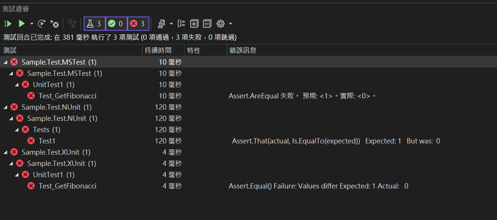

import Tabs from '@theme/Tabs';
import TabItem from '@theme/TabItem';

## 開始之前

在進行單元測試之前，先從一個簡單的例子探索最基本的單元測試是甚麼，這個範例不會有任何的測試框架，不會用到任何的額外工具，僅使用最基本的 C# 語法，目的是體驗用程式碼來驗證程式的功能。

## 第一個測試

1. 嘗試開發一個方法，這個方法可以根據傳入的位置數值，回傳費波那契數列上相對應位置的數值。
2. 在下面的程式中可以看到，這 ***並不是*** 一個完整的單元測試，因為需要人工透過 Console 判斷測試是否正確，並沒有做到 Self Validating。
3. 根據下面的內容可以看出，其實用程式碼來測試程式，並不是一件多稀奇的事情，使用上就跟平常開發功能一樣，只是針對測試的程式碼，要開發的是驗證的功能，並非實際的功能。
4. 透過這個簡單的範例，可以看出寫出驗證的程式碼並不難，但是要如何搭配現有的工具和框架，讓測試的內容可以更好的被執行被驗證，才是單元測試所要注意的。

```csharp
using System;

// 針對待測項目建立實體
var sut = new TestMethods();

// 根據條件取得個條件的回傳結果
var result1 = sut.GetFibonacci(0);
var result2 = sut.GetFibonacci(1);

// 驗證結果與預期是否相符
Console.WriteLine($"費波那契數列中，第{1}個數為：{result1}, 驗證結果為{result1 == 0}");
Console.WriteLine($"費波那契數列中，第{2}個數為：{result2}, 驗證結果為{result2 == 1}");
Console.ReadLine();

public class TestMethods
{
    // 設計一個費波那契數列方法，輸入相對地的索引位置，取得正確的數值
    // 費波那契數列：每一個數字，都是前兩個數字的合
    // ex: 0, 1, 1, 2, 3, 5, 8, 13, 21 ...

    /// <summary>
    /// 根據索引取得 - 個費波那契數列 - 相對應位置的數值
    /// </summary>
    /// <param name="index">索引位置</param>
    public int GetFibonacci(int index)
    {
        return 0;
    }
}
```



## 第一個單元測試
一樣使用上面的例子，但是這次我們使用單元測試的框架來做開發。

<Tabs>
  <TabItem value="MStest" label="MStest" default>

    ```csharp
    using Microsoft.VisualStudio.TestTools.UnitTesting;

    namespace Sample.Test.MSTest;

    [TestClass]
    public class UnitTest1
    {
        [TestMethod]
        public void Test_GetFibonacci()
        {
            var sut = new TestMethods();

            var result1 = sut.GetFibonacci(0);
            var result2 = sut.GetFibonacci(1);

            Assert.AreEqual(0, result1);
            Assert.AreEqual(1, result2);
        }
    }

    public class TestMethods
    {
        // 設計一個費波那契數列方法，輸入相對地的索引位置，取得正確的數值
        // 費波那契數列：每一個數字，都是前兩個數字的合
        // ex: 0, 1, 1, 2, 3, 5, 8, 13, 21 ...

        /// <summary>
        /// 根據索引取得 - 個費波那契數列 - 相對應位置的數值
        /// </summary>
        /// <param name="index">索引位置</param>
        public int GetFibonacci(int index)
        {
            return 0;
        }
    }
    ```
  </TabItem>

  <TabItem value="NUnit" label="NUnit">

    ```csharp
    using NUnit.Framework;
    using NUnit.Framework.Legacy;

    namespace Sample.Test.NUnit;

    public class Tests
    {
        [SetUp]
        public void Setup()
        {
        }

        [Test]
        public void Test1()
        {
            var sut = new TestMethods();

            var result1 = sut.GetFibonacci(0);
            var result2 = sut.GetFibonacci(1);

            ClassicAssert.AreEqual(0, result1);
            ClassicAssert.AreEqual(1, result2);
        }

        public class TestMethods
        {
            // 設計一個費波那契數列方法，輸入相對地的索引位置，取得正確的數值
            // 費波那契數列：每一個數字，都是前兩個數字的合
            // ex: 0, 1, 1, 2, 3, 5, 8, 13, 21 ...

            /// <summary>
            /// 根據索引取得 - 個費波那契數列 - 相對應位置的數值
            /// </summary>
            /// <param name="index">索引位置</param>
            public int GetFibonacci(int index)
            {
                return 0;
            }
        }
    }
    ```
  </TabItem>

  <TabItem value="XUnit" label="XUnit">

    ```csharp
    using Xunit;

    namespace Sample.Test.XUnit;

    public class UnitTest1
    {
        [Fact]
        public void Test_GetFibonacci()
        {
            var sut = new TestMethods();

            var result1 = sut.GetFibonacci(0);
            var result2 = sut.GetFibonacci(1);

            Assert.Equal(0, result1);
            Assert.Equal(1, result2);
        }

        public class TestMethods
        {
            // 設計一個費波那契數列方法，輸入相對地的索引位置，取得正確的數值
            // 費波那契數列：每一個數字，都是前兩個數字的合
            // ex: 0, 1, 1, 2, 3, 5, 8, 13, 21 ...

            /// <summary>
            /// 根據索引取得 - 個費波那契數列 - 相對應位置的數值
            /// </summary>
            /// <param name="index">索引位置</param>
            public int GetFibonacci(int index)
            {
                return 0;
            }
        }
    }
    ```
  </TabItem>
</Tabs>

可以從 **測試總管** 可以馬上看出問題發生的原因和地方


## 結論

1. 每一個框架的 API 都有些許不同，個人經驗並非使用全部使用內建的 API，部分還會搭配其他的套件一起使用，在單元測試框架的選擇上，建議還是需要和團隊做討論後再做決定。

2. 想像一下，如果專案有好好寫單元測試，輕鬆地執行所有測試，馬上就可以知道自己的程式有沒有改壞別人的功能，這不但增加我們開發的信心，對於重構也會更加有自信。

3. 有了單元測試，可以降低手動測試的比例，讓測試只要寫一次，就可以重複執行。

