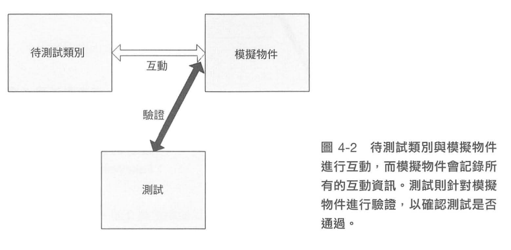

## 定義
> 假物件是通用的名詞，可以拿來描逑一個虛設常式物件或模擬物件。  
> 一個假物件，究竟是虛設常式物件還是模擬物件，取決於它在目前測試裡的使用方式。  
> 如果這個假物件是用來做驗證的，那它就是模擬物件。  
> 反之，就是虛設常式物件。

## 為何需要假物件

>撰寫單元測試的時候，當情境需要驗證的是待測功能有呼叫到外部的服務，如果不透過一個假物件，那就必須要把所有相關的依賴服務都啟動起來，會讓單元測試很複雜，而且也沒有辦法滿足 `Isolated` 這個特點。[參考](03_優秀的單元測試.md/#first-原則)  

### 模擬物件 (Mock)
例如，[驗證互動](./assert/04_互動.md)，我只是要簡單驗證 **[呼叫外部 WebService]** 的這個動作有執行，至於實際上這個服務存不存在，並不是這個測試要關心的問題。  
所以，我們透過一個假物件，假裝這個服務是存在的，並透過這個我們自己做出來且能夠完全控制的物件，去確認這個物件的動作是否有符合我們的預期。



### 虛設常式 (Stub)
例如，當驗證的結果與外部服務無關，只是需要這個外部服務回傳的資料，驗證後面的邏輯。至於這個外部服務，能不能夠成功運行，並不是這個單元測試需要關心的問題。  
所以，我們透過一個假物件，假裝這個服務是存在的，並透過這個我們自己做出來且能夠完全控制的物件，直接回傳我們需要的資料，驗證需要驗證的功能流程即可。

想看看下面的例子，假設我們要測試`GetMessage`的功能，只要聖誕節當天執行該功能，要回傳`Merry Christmas`，但是因為直接使用了 DateTime，如果不把這個物件改成虛設常式，是不是只能調整系統時間才有辦法驗證？
```csharp showLineNumbers
public class Target
{
    public string GetMessage()
    {
        var dt = DateTime.Now;
        if (dt.Month == 12 && dt.Day == 25)
        {
            return "Merry Christmas";
        }

        return string.Empty;
    }
}
```


## 如何 做出/使用 假物件
1. 模擬框架：有很多開源好用的模擬框架可以使用，不用自己手刻，輕鬆寫意。
   - NSubstitute
   - Moq
   - FakeItEasy
2. 使用：透過介面隔離 + 注入 (屬性，建構式)
   > 任何物件導向的問題，都可以透過增加一層中介層來解決。  
   > 透過這個中介層把物件傳入，同時這個中介層也提供了擴展的能力，讓我們很方便地把假物件傳入。

## 結論
1. 虛設常式 (Stub) 和模擬物件 (Mock)，都是假物件。
2. 一個測試案例只測試一種情境，所以一個測試案例最多只有一個模擬物件。

## Reference
[單元測試的藝術](https://www.tenlong.com.tw/products/9789864342471?list_name=c-unit-test)