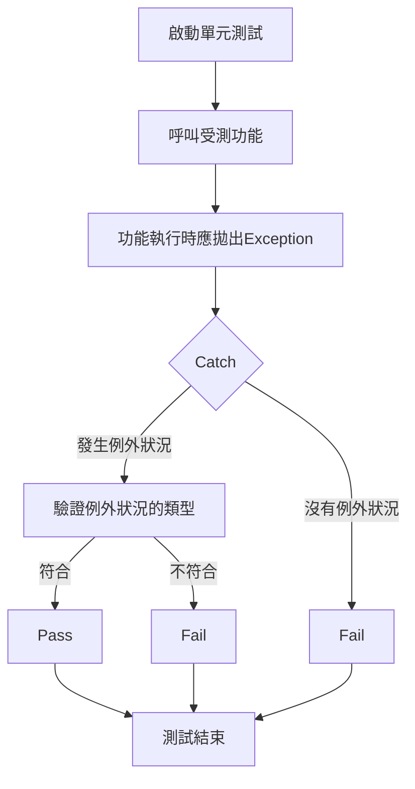

import Tabs from '@theme/Tabs';
import TabItem from '@theme/TabItem';

## 定義
驗證功能拋出的例外狀況與預期相符合。

## 流程


## 測試情境

1. 有一個類別 LogAnalyzer，這類別提供 Log 相關的功能。
2. 有一個方法`IsValidLogFileName`，可以用來檢查 log 檔案的附檔名是符合規範，且不區分大小寫。
3. 當檔名為空時，需要拋出 Exception: `ArgumentException`
4. 需要撰寫單元測試驗證這個方法的正確與否。

:::warning
下面的範例內容都很單純，不過不同測試框架的作法或是功能上會略有不同，寫法無法完全一致。  
如果需要搭配練習，建議理解後，依目前自己正在使用/學習的工具嘗試看看。
:::

## 範例

<Tabs>
  <TabItem value="LogAnalyzer" label="LogAnalyzer" default>

    ```csharp showLineNumbers
    namespace Lab.Test.Unit.LogNotification;

    public class LogAnalyzer
    {
        public bool IsValidLogFileName(string fileName)
        {
            // highlight-start
            if (string.IsNullOrEmpty(fileName))
            {
                throw new ArgumentException("fileName has to be provided");
            }
            // highlight-end

            var isValid = fileName.EndsWith(".SLF", StringComparison.CurrentCultureIgnoreCase);

            return isValid;
        }
    }
    ```
  </TabItem>

  <TabItem value="LogAnalyzerTests" label="LogAnalyzerTests">

    ```csharp showLineNumbers
    namespace Lab.Test.Unit.LogNotificationTests;

    [UnitTest("LogAnalyzer")]
    public class LogAnalyzerTests
    {
        private readonly LogAnalyzer _sut = new LogAnalyzer();

        // highlight-start
        [Fact(DisplayName = "IsValidLogFileName_檔名為空_Throws")]
        public void IsValidLogFileName_EmptyFileName_Throws()
        {
            // arrange
            // var sut = new LogAnalyzer();

            // act
            Action act = () => this._sut.IsValidLogFileName(null);

            // assert
            act.Should().Throw<ArgumentException>();
        }
        // highlight-end

        [Fact(DisplayName = "IsValidLogFileName_附檔名有誤_回傳 False")]
        public void IsValidLogFileName_BadExtension_ReturnFalse()
        {
            // arrange
            // var sut = new LogAnalyzer();

            // act
            var expected = this._sut.IsValidLogFileName("filewithbadextension.foo");

            // assert
            expected.Should().BeFalse();
        }

        [Theory(DisplayName = "IsValidLogFileName_附檔名正確且不區分大小寫_回傳 True")]
        [InlineData("filewithgoodextension.slf")]
        [InlineData("filewithgoodextension.SLF")]
        public void IsValidLogFileName_GoodExtensionLowerCase_ReturnTrue(
            string fileNmae)
        {
            // arrange
            // var sut = new LogAnalyzer();

            // act
            var expected = this._sut.IsValidLogFileName(fileNmae);

            // assert
            expected.Should().BeTrue();
        }
    }
    ```
  </TabItem>
</Tabs>


## 案例參考
[單元測試的藝術](https://www.tenlong.com.tw/products/9789864342471?list_name=c-unit-test)