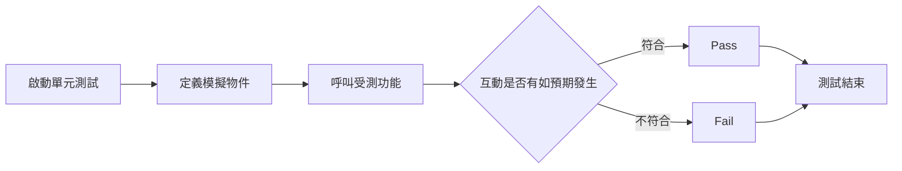

import Tabs from '@theme/Tabs';
import TabItem from '@theme/TabItem';

## 定義
驗證目標物件和其他物件的互動是否符合預期。

## 流程

## 測試情境

1. 有一個類別 LogAnalyzer，這類別提供 Log 相關的功能。
2. 有一個方法`IsValidLogFileName`，可以用來檢查 log 檔案的附檔名是符合規範，且不區分大小寫。
3. 有一個屬性`WasLastFileNameValid`，會記住最後一次驗證的結果。
4. 當檔名為空時，需要拋出 Exception: `ArgumentException`。
5. 有一個方法`Analyze`，可以用來檢查檔名的長度是否符合規範，如果不符合要透過外部的 WebService 紀錄。
6. 需要撰寫單元測試驗證方法的正確與否。

:::warning
這個範例需要搭配模擬物件的概念，透過一個模擬物件，確認模擬物件地的互動結果，來做驗證。  
詳細的觀念可以參考後面的內容。[連結](../05_假物件.md)
:::

## 範例

<Tabs>
  <TabItem value="LogAnalyzer" label="LogAnalyzer" default>

    ```csharp showLineNumbers
    namespace Lab.Test.Unit.LogNotification;

    public class LogAnalyzer
    {
        // highlight-start
        private readonly IWebService _webService;

        public LogAnalyzer(IWebService webService)
        {
            this._webService = webService;
        }
        // highlight-end

        public bool WasLastFileNameValid { get; set; }

        public bool IsValidLogFileName(string fileName)
        {
            this.WasLastFileNameValid = false;
            if (string.IsNullOrEmpty(fileName))
            {
                throw new ArgumentException("fileName has to be provided");
            }

            var isValid = fileName.EndsWith(".SLF", StringComparison.CurrentCultureIgnoreCase);
            this.WasLastFileNameValid = isValid;

            return isValid;
        }

        // highlight-start
        public void Analyze(string fileName)
        {
            if (fileName.Length<8)
            {
                this._webService.LogError($"FIleName too short: {fileName}");
            }
        }
        // highlight-end
    }
    ```
  </TabItem>

  <TabItem value="IWebService" label="IWebService">

    ```csharp showLineNumbers
    public interface IWebService
    {
        void LogError(string message);
    }
    ```
  </TabItem>

  <TabItem value="LogAnalyzerTests" label="LogAnalyzerTests">

    ```csharp showLineNumbers
    namespace Lab.Test.Unit.LogNotificationTests;

    [UnitTest("LogAnalyzer")]
    public class LogAnalyzerTests
    {
        // highlight-start
        private readonly IWebService _fakeWebService = Substitute.For<IWebService>();

        // private readonly LogAnalyzer _sut = new LogAnalyzer();
        private readonly LogAnalyzer _sut;

        public LogAnalyzerTests()
        {
            this._sut = new LogAnalyzer(this._fakeWebService);
        }
        // highlight-end

        [Fact(DisplayName = "IsValidLogFileName_檔名為空_Throws")]
        public void IsValidLogFileName_EmptyFileName_Throws()
        {
            // arrange
            // var sut = new LogAnalyzer();

            // act
            Action act = () => this._sut.IsValidLogFileName(null);

            // assert
            act.Should().Throw<ArgumentException>();
        }

        [Fact(DisplayName = "IsValidLogFileName_附檔名有誤_回傳 False")]
        public void IsValidLogFileName_BadExtension_ReturnFalse()
        {
            // arrange
            // var sut = new LogAnalyzer();

            // act
            var expected = this._sut.IsValidLogFileName("filewithbadextension.foo");

            // assert
            expected.Should().BeFalse();
        }

        [Theory(DisplayName = "IsValidLogFileName_附檔名正確且不區分大小寫_回傳 True")]
        [InlineData("filewithgoodextension.slf")]
        [InlineData("filewithgoodextension.SLF")]
        public void IsValidLogFileName_GoodExtensionLowerCase_ReturnTrue(
            string fileNmae)
        {
            // arrange
            // var sut = new LogAnalyzer();

            // act
            var expected = this._sut.IsValidLogFileName(fileNmae);

            // assert
            expected.Should().BeTrue();
        }

        [Theory(DisplayName = "IsValidLogFileName_記住最後一次驗證結果_與驗證結果相符")]
        [InlineData("badfile.foo", false)]
        [InlineData("goodfile.slf", true)]
        public void IsValidLogFileName_WhenCalled_ChangeWasLastFileNameValid(
            string fileNmae,
            bool expected)
        {
            // arrange
            // var sut = new LogAnalyzer();

            // act
            this._sut.IsValidLogFileName(fileNmae);

            // assert
            this._sut.WasLastFileNameValid.Should().Be(expected);
        }

        // highlight-start
        [Fact(DisplayName = "Analyze_檔名長度太短_呼叫外部服務")]
        public void Analyze_TooShortFileName_CallWebService()
        {
            // arrange

            // act
            this._sut.Analyze("1234567");

            // assert
            this._fakeWebService.Received(1).LogError(Arg.Any<string>());
        }

        [Fact(DisplayName = "Analyze_檔名長度>=8(符合規則)_不呼叫外部服務")]
        public void Analyze_ByDefault_CallWebService()
        {
            // arrange

            // act
            this._sut.Analyze("12345678");

            // assert
            this._fakeWebService.Received(0).LogError(Arg.Any<string>());
        }
        // highlight-end
    }
    ```
  </TabItem>
</Tabs>

## 案例參考
[單元測試的藝術](https://www.tenlong.com.tw/products/9789864342471?list_name=c-unit-test)