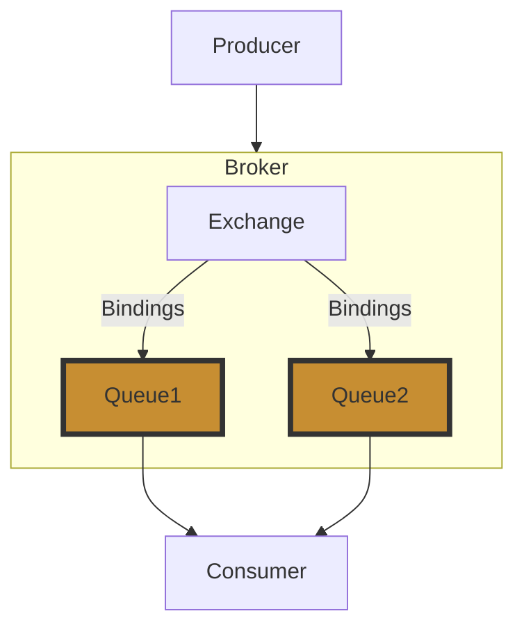

import Tabs from '@theme/Tabs';
import TabItem from '@theme/TabItem';

在[前面](../intro.md)的內容中，我們知道大部分的 MQ 設計，基本上就是三個要素。

1. Producer: 訊息發送方
2. Broker: 訊息代理
3. Consumer: 訊息接收方

同樣，RabbitMQ 也是相似的設計去做開發。

## Broker

### Exchange

負責接收生產者 (Producer) 發送的訊息，根據路由綁定，送到符合的 Queue。

RabbitMQ Exchange 共有四種類型。

| 交換類型 | 算法                                 |
| -------- | ------------------------------------ |
| Direct   | 根據路由鍵的精確匹配將消息傳送到佇列 |
| Topic    | 根據路由鍵的模式匹配將消息路由到佇列 |
| Header   | 根據消息的標頭將消息路由到佇列       |
| Fanout   | 將消息傳送到所有綁定的佇列           |

<Tabs>
  <TabItem value="Direct" label="Direct" default>

    ```mermaid
    flowchart TD
        Direct(Direct) -->|Binding Key| Queue1
    ```

  </TabItem>
  <TabItem value="Topic" label="Topic" default>

    ```mermaid
    flowchart TD
        Topic(Topic) -->|us.*| Queue1
        Topic -->|in.*| Queue2
    ```

  </TabItem>
  <TabItem value="Header" label="Header" default>

    ```mermaid
    flowchart TD
        Header(Header) -->|us.*| Queue1
        Header -->|in.*| Queue2
    ```

  </TabItem>
  <TabItem value="Fanout" label="Fanout" default>

    ```mermaid
    flowchart TD
        Fanout(Fanout) --> Queue1
        Fanout --> Queue2
        Fanout --> Queue3
    ```

  </TabItem>
</Tabs>


负责接收生产者发送的消息并将其路由到一个或多个队列。交换机的类型和绑定规则决定了消息的路由方式。


RabbitMQ 基礎概念及入門知識
RabbitMQ 簡介
RabbitMQ 是一個基於 Erlang 開發的消息隊列系統，遵循 AMQP（Advanced Message Queuing Protocol）標準，具有高可用性、可擴展性、靈活性等特點。

基礎概念
Producer（生產者）：消息的發送方。
Consumer（消費者）：消息的接收和處理方。
Queue（隊列）：存放消息的隊列，生產者將消息發送到隊列，消費者從隊列中取出消息。
Exchange（交換器）：接收生產者發送的消息並根據路由鍵（Routing Key）將消息轉發到一個或多個隊列。
Binding（綁定）：交換器和隊列之間的關係，通過路由鍵來指定。
Routing Key（路由鍵）：消息的路由信息，用於決定消息應該發送到哪個隊列。
入門操作
安裝 RabbitMQ：可以通過 Docker、包管理器（如 apt、yum）或官方安裝包進行安裝。
運行 RabbitMQ：啟動 RabbitMQ 服務，並訪問管理界面
簡單示例：創建一個隊列，使用生產者發送消息，消費者接收消息。
RabbitMQ 的進階使用
高可用性設計：通過鏡像隊列和集群配置來保證 RabbitMQ 的高可用性。
性能調優：包括內存管理、磁盤配置、消息持久化等方面的調優。
安全性配置：設置用戶權限、使用 TLS 加密等來保障消息的安全。
監控和管理：利用 RabbitMQ 管理界面和 API 進行監控，結合 Prometheus、Grafana 等工具進行監控和告警。
實踐案例：結合具體業務場景，實現消息隊列的最佳實踐。
這些內容的詳細描述需要逐步展開，請您確認目前的介紹是否清晰，並指出需要補充的部分。之後我們可以進一步深入到每個環節的具體操作和實踐細節。


## Reference
[參考 1](https://medium.com/cwan-engineering/rabbitmq-concepts-and-best-practices-aa3c699d6f08)  


