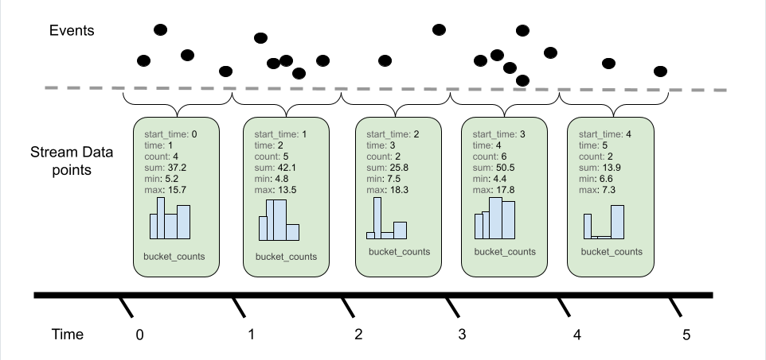

## 遙測的重要性和基本概念

在單體架構中，追蹤問題可能是相對簡單的，因為所有的邏輯和操作都集中在一個應用中。然而，現代應用程式越來越多地使用微服務架構，又或者是服務導向架構，一個 Request 可能會經過數十個甚至上百個服務。這使得問題的追蹤和定位變得困難且耗時。

如果一個 Request 回應時間比預期要長，問題可能發生在其中某一個服務、數據庫查詢或是第三方 API 上。如果沒有合適的遙測工具，這樣的問題可能會變得非常難以排查。

OpenTelemetry 可以建立這樣的能力：

1. 快速定位問題：透過 Tracing，你能夠看到 Request 在不同服務間的傳遞，並了解哪個步驟時間成本最高。
2. 量化系統性能：使用 Metrics 來跟蹤你的服務是否按預期運行，並在超出範圍時觸發告警。
3. 故障診斷：通過 Logs 和 Tracing 的結合，快速了解問題發生時的上下文，幫助快速釐清錯誤。

### 背景與歷史

在 OpenTelemetry 問世之前，已有幾個知名的監控工具 (還有各種程式語言的 Profiler 工具)，例如：

1. OpenTracing：提供統一的 API，用於 Tracing，讓開發者能夠在多個追蹤系統之間互操作。
2. OpenCensus：Google 開發的一個收集 Tracing 和 Metrics 的框架，旨在提供跨服務和應用的性能監控。

因為不同的工具和數據格式，常常會因為數據規格不兼容，導致被特定的平台或是工具所綁定。因此，開源社區決定合併這兩個項目，並創建 OpenTelemetry 這個統一標準。此外，隨著雲原生架構的興起，系統的複雜性越來越高，企業迫切需要一個可以適應多種環境的標準化解決方案。

OpenTelemetry 不僅解決了這些問題，還提供了靈活的架構，可以擴展到不同的監控後端系統。

:::info 單體應用中的 OpenTelemetry
雖然 OpenTelemetry 對於分散式架構或微服務系統特別有用，但在單體應用中使用它同樣能帶來顯著好處。以下是單體應用中使用 OpenTelemetry 的幾個優勢：

1. 統一架構：提供統一的遙測數據收集方法，減少使用多個工具帶來的開發和運維負擔。
2. 性能分析：追蹤應用內部不同模組或功能之間的互動，幫助發現應用中的性能問題。
3. 未來擴展：如果需要將應用擴展為微服務架構，使用 OpenTelemetry 可以使轉型過程更加平滑，開發者可以輕鬆地將現有的遙測機制擴展到分散式系統中。
4. 故障診斷：即便在單體系統中，也可以有效地捕捉錯誤發生的具體路徑和上下文，幫助開發者更快速地進行問題定位和修復。

因此，不管應用是單體還是分散式，OpenTelemetry 提供的遙測能力都能帶來顯著的效益，更好地管理其服務的運行狀態和性能。
:::

### 架構

1. 統一的 API 和多種 SDK 支援  
統一的 API，意味著只需要學習一套標準化的 API 來收集遙測數據，不會因為不同的開發語言產生額外學習的成本。

2. 跨平台  
無論你是在本地部署的服務，還是運行在雲端平台，都能夠使用。  
同時支持虛擬機、容器化環境以及無伺服器架構，讓開發者可以輕鬆地收集和導出觀察性數據，無需為不同的運行環境使用不同的工具。

3. 彈性與可擴展性  
不僅能夠滿足小型應用的需求，也能夠處理大規模分散式系統中的高流量數據。

4. 模組化設計  
API、SDK 和 Collector 分開，可以根據應用需求靈活選擇需要的模組，而不必全部導入。  
:::info Example
如果你只需要追蹤功能，你可以僅使用 Tracing 部分，而不需要引入完整的遙測功能。
:::

5. Sampling Strategies(採樣策略)  
可以根據系統負載情況設置不同的采樣率。  
:::info Example
例如，在流量高峰期，你可以選擇只追蹤 10% 的請求數據，而在流量較低的時段則可以追蹤更多請求。
:::

7. 第三方工具兼容
充分考慮到了與其他遙測工具的兼容性。  
目前許多不同的遙測平台 (如 Jaeger、Prometheus、Grafana)，都可以正常運作。

8. 開放標準與社區支持  
OpenTelemetry 是一個由 CNCF 支持的開源項目，這使得它具有極大的兼容性和持續發展潛力。  
- 廠商中立：OpenTelemetry 是一個開放的標準，這意味著它不會綁定到某一個特定的供應商或平台。
- 強大的社區支持：作為 CNCF 下的一個項目，OpenTelemetry 得到了來自全球眾多開發者和公司的支持。

## 三大支柱

### Tracing (分佈式追蹤)

Tracing 是理解複雜分散式系統中 Request 路徑的核心工具。能夠讓維運人員清楚地看到每個 Request 在多個服務之間的傳遞，並記錄每個步驟的執行時間。這樣你可以很容易地找出系統中的性能瓶頸或失敗的節點。

在 OpenTelemetry 中，Tracing 是通過 Traces 和 Spans 來實現的：

Trace：是一個 Request 或工作流程的全局表示，代表從開始到結束的整個過程。它可能包括跨多個服務或應用程式。  
Span：是一個 Trace 的基本構成單位。每個 Span 包含操作的名稱、開始和結束時間、參數（如標籤、事件）等。可以嵌套在彼此之中，這樣能清楚地表現出各個步驟的層次結構和相互依賴關係。

  
  

適用場景：  
- 性能瓶頸分析
- 跨服務故障排查/定位
- 用戶 Request 路徑可視化

### Metrics (指標)

Metrics 是用來量化系統的健康狀況與性能表現。Metrics 通常以數值的形式出現，並且可以是瞬時值或累積值，例如 CPU 使用率、回應時間、錯誤率、RPS...等。

- Counter：只會增長的指標，通常用來測量系統中某些事件的次數。例如，HTTP Request 的總數或錯誤次數。
- Sums：類似於 Counter，但它更靈活，允許開發者在特定場景下也可以進行減少操作。例如，活躍連接數。
- Gauge：可以增減的指標，通常反映系統的當前狀態。可能包含，CPU 使用率、記憶體使用量...等。
- Histogram：將數據分布到不同的範圍中，幫助你了解數據的分布情況。例如，HTTP 回應時間的分布。
- Summary：類似於直方圖，但它提供的是特定數據的統計。  

  
  
  

適用場景：  
- 系統狀態監控：通過監控應用的各種 Metrics，並在數值超出預設範圍時自動觸發告警。
- 資源規劃：監控系統的資源使用情況，從而進行合理的容量規劃。
- 性能趨勢：分析系統的性能趨勢，提前預測和解決可能出現的性能瓶頸。

### Logs (日誌)
Logs 是系統在特定時刻的具體事件和行為，通常用於排查錯誤和了解系統在特定時間的運行狀態。可以捕捉每個 Request 處理的詳細資訊，包括 Request 參數、處理過程中的上下文數據以及發生錯誤時的詳細內容。

Logs 的典型使用場景包括：

- 故障診斷：當系統出現錯誤時，提供詳細的錯誤上下文和具體的錯誤訊息，快速定位問題。
- 事件追溯：通過 Logs 了解某些事件發生的背景和流程，找出系統中的異常行為。
- 審計：Logs 記錄了系統中的重要事件，可用於後期的安全審計和風險分析。

## 相輔相成

遙測整體性的一個核心點是，三大支柱並不是彼此獨立的工具或方法，而是從不同角度提供關鍵數據，互為補充，從而幫助開發者更高效地診斷問題並優化系統。

### Tracing + Metrics

Tracing 可以用來記錄一個 Request 不同服務之間的完整路徑，並追蹤每個步驟的時間成本。但僅靠 Tracing，只能知道特定的 Request 或是某個情境下的某一個步驟耗時較多，對於在整個系統中的影響難以評估。

:::info 說明
某個查詢操作耗時 500ms，但這只是單一請求的數據。如果 Metrics 顯示，這樣的查詢操作每秒發生上千次，那麼這個耗時的問題就變得非常重要，因為它會嚴重影響系統的整體性能。  
反之，如果這樣的操作在整體系統查詢的 Request 內，僅佔據極少部分，那該問題的優先度也許就沒那麼急迫。

這樣的數據可以幫助開發者不僅看到問題所在，還能衡量問題的嚴重性。
:::

### Tracing + Logs
Tracing 可以用來記錄一個 Request 不同服務之間的完整路徑，並顯示哪些服務出現了問題，但它可能無法提供詳細的錯誤上下文。這時候，詳細的 Logs 數據可以提供更多有關錯誤的具體訊息，包括錯誤的根本原因、當時的系統狀態、上下文等。

:::info 說明
某個服務在特定的 API 呼叫發生了錯誤，但 Logs 會提供具體的錯誤訊息，比如具體的 Stacks、錯誤代碼、以及當時的上下文狀態，讓你能夠進一步深入診斷問題。
這樣，當出現問題時，你不僅能夠知道錯誤發生在哪個服務或哪個模塊，還可以快速深入了解問題的細節。
:::

### Metrics + Logs
Metrics 提供了一個全局的系統狀態總覽，例如系統的 CPU 使用率、記憶體使用、Request 數量等。當某些 Metrics 異常時，開發者可以進一步利用 Logs 來深入了解具體的異常原因。

:::info 說明
某個 API 的回應時間異常增高，這可能暗示出現了性能瓶頸，或者某個服務正在面臨壓力。此時，開發者可以根據這些異常 Metrics，查看具體的 Logs，進一步排查問題。  
通過 Metrics，你可以高效地監控整個系統的運行狀態，而 Logs 則幫助你對具體異常情況進行深入分析和回溯。
:::

## 總結
遙測的整體性意味著 Tracing、Metrics 和 Logs 是相輔相成、互相補充的。它們為開發者提供了從高層次到細節的全方位監控能力，使問題排查、性能優化以及故障修復過程變得更加高效。

## Reference
https://opentelemetry.io/docs/specs/otel/metrics/data-model/  
https://dev.to/siddhantkcode/the-mechanics-of-distributed-tracing-in-opentelemetry-1ohk  
https://dev.to/amplication/distributed-tracing-and-opentelemetry-guide-8b6  
https://microsoft.github.io/code-with-engineering-playbook/observability/log-vs-metric-vs-trace/  
